# 单节点深度测评报告

针对生命科学计算的高性能集群性能分析及评测框架，使用代表性生物学计算软件集合，通过Prometheus监控软件对运行时CPU、GPU、内存、IO等资源需求特征进行监控，使用计算用时、计算效率、CPU核时、GPU卡时等关键评价指标对集群性能进行测评和打分，帮助指导生命科学计算集群的建设、提升生命科学计算生产效率。  
单节点深度测评报告中每款计算软件的测试内容和测试结果分为两大部分：  
1. 运行特征及运行模式分析。包括单任务和大批量任务作业的运行特征分析、单任务使用不同数量GPU卡的并行计算效率分析（部分不支持多卡并行的软件除外）、大批量任务不同并行规模性能分析（部分不支持多卡并行的软件除外）、单任务计算用时稳定性分析等。这些分析结果用于帮助用户评估相关计算软件在测试节点上运行是否存在瓶颈、分析在测试节点配置下最高效或最经济的运行模式。
2. 节点配置性能打分。使用运行模式分析中的计算用时、计算能耗、计算用时稳定性、分子动力学模拟性能（仅限分子动力学模拟软件）等指标进行多维度打分，并计算该软件在测试节点配置下的性能综合得分。  

&nbsp;
&nbsp;

## SPONGE
软件版本：v1.4  
数据集：https://doi.org/10.5281/zenodo.12200627 夏 义杰. Test Data for Comparing Simulation Speed between SPONGE and AMBER. Zenodo; 2024.  
测试硬件配置：GPU型号NVIDIA A100-SXM4-80GB，GPU卡数8，单卡显存80.0GB，CPU型号Intel(R) Xeon(R) Platinum 8358 CPU @ 2.60GHz，CPU核心数64，内存容量1007.52GB。文件系统挂载点/rdxfs，文件系统类型lustre，文件系统可用容量800976.84GB，文件系统使用率48%。  

&nbsp;
测评内容：  
1. 单任务运行特征分析。记录软件计算时对GPU、CPU、内存、I/O读写带宽等资源的使用情况和功耗，输出从任务运行到结束的资源使用情况雷达图，帮助用户了解软件资源需求特征、分析被测节点配置是否存在瓶颈。
2. 单任务计算用时稳定性分析。多次测试相同单任务的计算用时，统计计算用时分布，输出小提琴图。本指标是为了测试被测节点的软硬件环境是否存在较大的性能波动。
3. 大批量任务运行特征分析。记录计算软件在大批量任务并行模式下的GPU、CPU、内存、I/O读写带宽等资源的使用情况和功耗，输出从任务运行到结束的资源使用情况雷达图，帮助用户了解软件在大批量任务并行模式下的资源需求特征、分析被测节点配置是否存在瓶颈。  

&nbsp;
计算当前硬件配置下软件性能得分。本测评根据单任务性能得分、计算用时稳定性得分、大批量任务计算用时得分、大批量任务计算能耗得分等四个细分指标的综合计算，得到单节点的SPONGE性能总分。  
$$
总得分=avg(单任务性能得分\times\frac{计算用时稳定性得分}{100}+大批量任务计算用时得分+大批量任务计算能耗得分)
$$
四个细分指标详述如下：  
① 单任务性能得分：根据多次相同单任务的平均分子动力学模拟性能计算。  
$$
单任务性能得分={系数}\times{分子动力学模拟性能}
$$
② 计算用时稳定性：根据多次相同单任务的用时分布计算。  
$$
单任务计算稳定性得分=max((1-\frac{计算用时标准差}{计算用时均值})\times100,0)
$$
③ 大批量任务计算用时得分：根据大批量任务并行的总用时计算。  
$$
大批量任务计算用时得分=系数\times\frac{任务数量}{计算总用时}
$$
④ 大批量任务计算能耗得分：根据大批量任务并行的总能耗计算。  
$$
大批量任务计算能耗得分=系数\times\frac{任务数量}{计算总能耗}
$$
注：系数以一个标准配置为基准（100分）来确定，测试硬件配置的最终得分为相对于标准配置的相对得分。分子动力学模拟性能为分子动力学模拟软件常用的性能指标，单位为ns/day，表示在当前硬件和输入参数条件下每天能够模拟的纳秒数，该值越大代表单位时间内能完成更长时间的分子动力学模拟，代表硬件配置性能更好。  
&nbsp;

### 单任务运行特征分析：
  
注：从顶端顺时针一周为软件单任务运行期间各指标使用情况，将各个指标缩放到同一尺度并使用不同比例尺进行对比展示。(包括CPU使用率、 内存使用量、I/O读带宽、I/O写带宽、功耗)  

  
注：从顶端顺时针一周为软件单任务运行期间各指标使用情况，将各个指标缩放到同一尺度并使用不同比例尺进行对比展示。(包括GPU使用率和全部显存使用量)  

  
注：从顶端顺时针一周为软件单任务运行期间各指标使用情况，从内向外不同层级分别展示一个指标的变化情况，每个层级内侧线为0，外侧线为该指标全程的最大值，指标范围见图例。  

&nbsp;
GPU使用率峰值：12.5%，中位数12.5%，平均值12.03%  
显存使用峰值：10.16GB，中位数10.16GB，平均值10.02GB  
CPU使用率峰值：100.0%，中位数2.58%，平均值3.42%  
内存使用峰值：13.29GB，中位数13.18GB，平均值13.15GB  
I/O读峰值速率：80.67MB/s，中位数2.32KB/s，平均值743.9KB/s  
I/O写峰值速率：22.74MB/s，中位数21.63KB/s，平均值985.18KB/s  
功耗峰值：2190.0W，中位数2160.0W，平均值2149.43W  
&nbsp;

### 单任务计算用时稳定性分析：
相同算例测试10次，统计用时分布。  
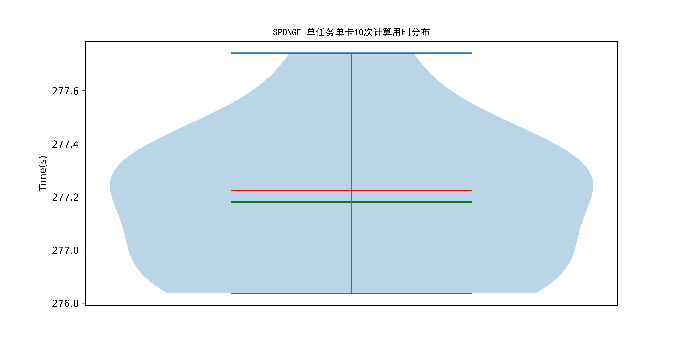  
注：纵坐标为计算用时。小提琴图代表多次测试的计算用时分布，小提琴图越宽的地方代表在该范围内的数据分布密度越高，也就是说越多的数据点集中在这个区间。红线代表多次测试的计算用时的中位数，绿线代表平均值。  

&nbsp;

### 大批量任务运行特征分析：
  
注：从顶端顺时针一周为软件50个任务并行运行期间各指标使用情况，将各个指标缩放到同一尺度并使用不同比例尺进行对比展示。(包括CPU使用率、 内存使用量、I/O读带宽、I/O写带宽、功耗)  

  
注：从顶端顺时针一周为软件50个任务并行运行期间各指标使用情况，将各个指标缩放到同一尺度并使用不同比例尺进行对比展示。(包括GPU使用率和全部显存使用量)  

  
注：从顶端顺时针一周为软件50个任务并行运行期间各指标使用情况，从内向外不同层级分别展示一个指标的变化情况，每个层级内侧线为0，外侧线为该指标全程的最大值，指标范围见图例。  

&nbsp;
GPU使用率峰值：100.0%，中位数100.0%，平均值81.25%  
显存使用峰值：33.46GB，中位数33.46GB，平均值28.45GB  
CPU使用率峰值：100.0%，中位数13.14%，平均值12.0%  
内存使用峰值：22.63GB，中位数21.74GB，平均值20.51GB  
I/O读峰值速率：944.14MB/s，中位数2.29KB/s，平均值2.76MB/s  
I/O写峰值速率：378.03MB/s，中位数21.44KB/s，平均值7.36MB/s  
功耗峰值：3860.0W，中位数3743.0W，平均值3413.04W  
&nbsp;

### 节点硬件配置性能打分：
测试软件：SPONGE  
单任务性能得分：100.2  
单任务计算用时稳定性得分：99.9  
大批量任务计算用时得分：100.0  
大批量任务计算能耗得分：99.99  
性能综合得分：100.03  

## GROMACS
软件版本：2023.3  
数据集：1WDN谷氨酰胺结合蛋白在水环境中的模型（61K原子），进行50,000 步（共 100 ps）的 NPT 模拟（恒压恒温），模拟温度为 300 K，压力为 1 atm  
测试硬件配置：GPU型号NVIDIA A100-SXM4-80GB，GPU卡数8，单卡显存80.0GB，CPU型号Intel(R) Xeon(R) Platinum 8358 CPU @ 2.60GHz，CPU核心数64，内存容量1007.52GB。文件系统挂载点/rdxfs，文件系统类型lustre，文件系统可用容量800976.83GB，文件系统使用率48%。  

&nbsp;
测评内容：  
1. 单任务运行特征分析。记录软件计算时对GPU、CPU、内存、I/O读写带宽等资源的使用情况和功耗，输出从任务运行到结束的资源使用情况雷达图，帮助用户了解软件资源需求特征、分析被测节点配置是否存在瓶颈。
2. 单任务并行效率分析。使用不同数量的GPU卡运行相同算例，统计计算用时、GPU卡时和分子动力学模拟性能，计算使用不同数量GPU卡的加速比和计算效率。通过本指标的评测，可以得知计算用时最少的单任务并行策略以及计算卡时最少的单任务并行策略。  

$$
\begin{align}
加速比&=\frac{该GPU卡数的分子动力学模拟性能}{单卡分子动力学模拟性能}\\
计算效率&=\frac{加速比}{GPU卡数}*100\%
\end{align}
$$
3. 单任务计算用时稳定性分析。多次测试相同单任务的计算用时，统计计算用时分布，输出小提琴图。本指标是为了测试被测节点的软硬件环境是否存在较大的性能波动。
4. 大批量任务并行效率分析。使用不同GPU卡数×并行任务数的组合测试计算软件大批量任务并行计算。输出不同运行模式计算用时的折线图，以及在目前节点配置下大批量任务并行时最佳并行模式。通过本指标的评测，可以得知在何种并行策略下大批量任务的计算总用时最少。
5. 大批量任务运行特征分析。记录计算软件在大批量任务并行模式下的GPU、CPU、内存、I/O读写带宽等资源的使用情况和功耗，输出从任务运行到结束的资源使用情况雷达图，帮助用户了解软件在大批量任务并行模式下的资源需求特征、分析被测节点配置是否存在瓶颈。  

&nbsp;
计算当前硬件配置下软件性能得分。本测评根据单任务性能得分、计算用时稳定性得分、大批量任务计算用时得分、大批量任务计算能耗得分等四个细分指标的综合计算，得到单节点的GROMACS性能总分。  
$$
总得分=avg(单任务性能得分\times\frac{计算用时稳定性得分}{100}+大批量任务计算用时得分+大批量任务计算能耗得分)
$$
四个细分指标详述如下：  
① 单任务性能得分：根据多次相同单任务的平均分子动力学模拟性能计算。  
$$
单任务性能得分={系数}\times{分子动力学模拟性能}
$$
② 计算用时稳定性：根据多次相同单任务的用时分布计算。  
$$
单任务计算稳定性得分=max((1-\frac{计算用时标准差}{计算用时均值})\times100,0)
$$
③ 大批量任务计算用时得分：根据大批量任务并行的总用时计算。  
$$
大批量任务计算用时得分=系数\times\frac{任务数量}{计算总用时}
$$
④ 大批量任务计算能耗得分：根据大批量任务并行的总能耗计算。  
$$
大批量任务计算能耗得分=系数\times\frac{任务数量}{计算总能耗}
$$
注：系数以一个标准配置为基准（100分）来确定，测试硬件配置的最终得分为相对于标准配置的相对得分。分子动力学模拟性能为分子动力学模拟软件常用的性能指标，单位为ns/day，表示在当前硬件和输入参数条件下每天能够模拟的纳秒数，该值越大代表单位时间内能完成更长时间的分子动力学模拟，代表硬件配置性能更好。  
&nbsp;

### 单任务运行特征分析：
  
注：从顶端顺时针一周为软件单任务运行期间各指标使用情况，将各个指标缩放到同一尺度并使用不同比例尺进行对比展示。(包括CPU使用率、 内存使用量、I/O读带宽、I/O写带宽、功耗)  

  
注：从顶端顺时针一周为软件单任务运行期间各指标使用情况，将各个指标缩放到同一尺度并使用不同比例尺进行对比展示。(包括GPU使用率和全部显存使用量)  

  
注：从顶端顺时针一周为软件单任务运行期间各指标使用情况，从内向外不同层级分别展示一个指标的变化情况，每个层级内侧线为0，外侧线为该指标全程的最大值，指标范围见图例。  

&nbsp;
GPU使用率峰值：50.12%，中位数49.38%，平均值34.66%  
显存使用峰值：10.26GB，中位数10.26GB，平均值9.4GB  
CPU使用率峰值：100.0%，中位数89.5%，平均值66.47%  
内存使用峰值：14.97GB，中位数14.96GB，平均值14.75GB  
I/O读峰值速率：46.24KB/s，中位数4.25KB/s，平均值8.96KB/s  
I/O写峰值速率：859.6KB/s，中位数23.34KB/s，平均值90.08KB/s  
功耗峰值：2957.0W，中位数2732.0W，平均值2490.56W  
&nbsp;

### 单任务并行效率分析：
计算用时：  
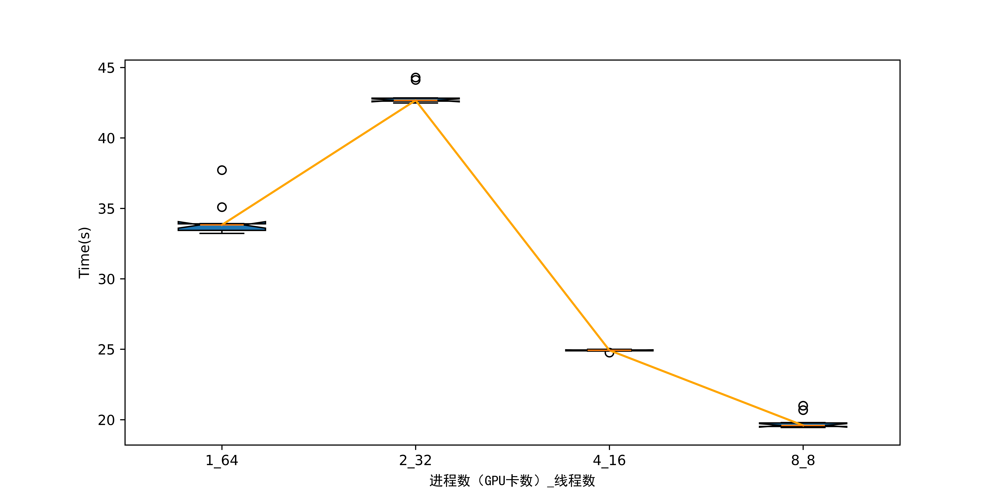  
注：横坐标为不同的进程数×线程数组合，纵坐标为任务运行时间，用于对比发现GROMACS单机多卡并行时计算用时最少的运行模式。进程数代表GROMACS开启的进程数，一个进程使用一张GPU卡，所以进程数可以理解为等价于使用的GPU卡数，因此进程数应<=GPU卡的总数。线程数代表每个进程使用线程数，通常使得进程数×线程数=CPU核心数能够充分利用到全部的CPU核心发挥最佳性能，因此选用进程数<=GPU卡数且能被CPU核心数整除的几种情况进行测试。  
**使用8张GPU卡并行计算时计算用时最少。**  
&nbsp;
计算所用GPU卡时：  
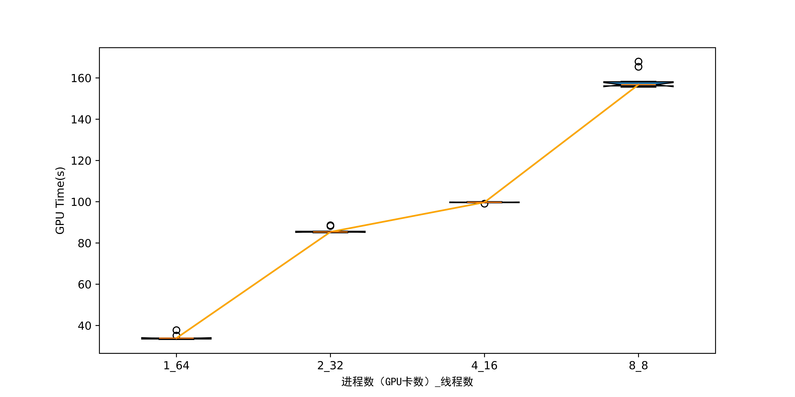  
注：横坐标为不同的进程数×线程数组合，纵坐标为任务计算所用的GPU卡时（GPU卡时=使用的GPU卡数×计算用时），用于对比发现GROMACS单机多卡并行时GPU卡时最少（GPU最经济）的运行模式。进程数代表GROMACS开启的进程数，一个进程使用一张GPU卡，所以进程数可以理解为等价于使用的GPU卡数，因此进程数应<=GPU卡的总数。线程数代表每个进程使用线程数，通常使得进程数×线程数=CPU核心数能够充分利用到全部的CPU核心发挥最佳性能，因此选用进程数<=GPU卡数且能被CPU核心数整除的几种情况进行测试。  
**使用1张GPU卡并行计算时GPU卡时最少。**  
&nbsp;
分子动力学模拟性能：  
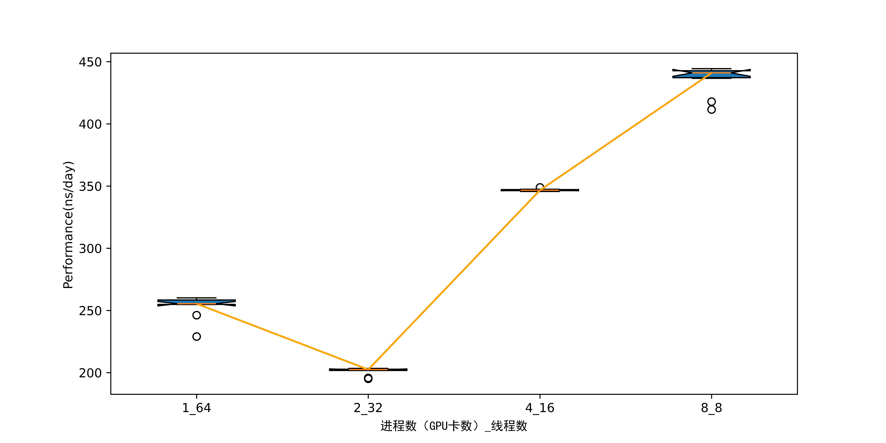  
注：横坐标为不同的进程数×线程数组合，纵坐标为分子动力学模拟性能，用于对比发现GROMACS单机多卡并行时分子动力学模拟性能的运行模式。进程数代表GROMACS开启的进程数，一个进程使用一张GPU卡，所以进程数可以理解为等价于使用的GPU卡数，因此进程数应<=GPU卡的总数。线程数代表每个进程使用线程数，通常使得进程数×线程数=CPU核心数能够充分利用到全部的CPU核心发挥最佳性能，因此选用进程数<=GPU卡数且能被CPU核心数整除的几种情况进行测试。分子动力学模拟性能为分子动力学模拟软件常用的性能指标，单位为ns/day，表示在当前硬件和输入参数条件下每天能够模拟的纳秒数，该值越大代表单位时间内能完成更长时间的分子动力学模拟，代表硬件配置性能更好。  
**使用8张GPU卡并行计算时分子动力学模拟性能最高。**  
&nbsp;
| 使用的GPU数量 | 分子动力学模拟性能（ns/day） | 加速比 | 计算效率 | 计算用时（s） | GPU卡时（s） |
| ---- | ---- | ---- | ---- | ---- | ---- |
| 1 | 255.44 | 1.0 | 100.0% | 33.83 | 33.83 |
| 2 | 202.49 | 0.79 | 39.64% | 42.67 | 85.34 |
| 4 | 346.65 | 1.36 | 33.93% | 24.92 | 99.7 |
| 8 | 440.99 | 1.73 | 21.58% | 19.59 | 156.74 |

### 单任务计算用时稳定性分析：
使用全部8张GPU卡并行计算相同算例，测试10次，统计用时分布。  
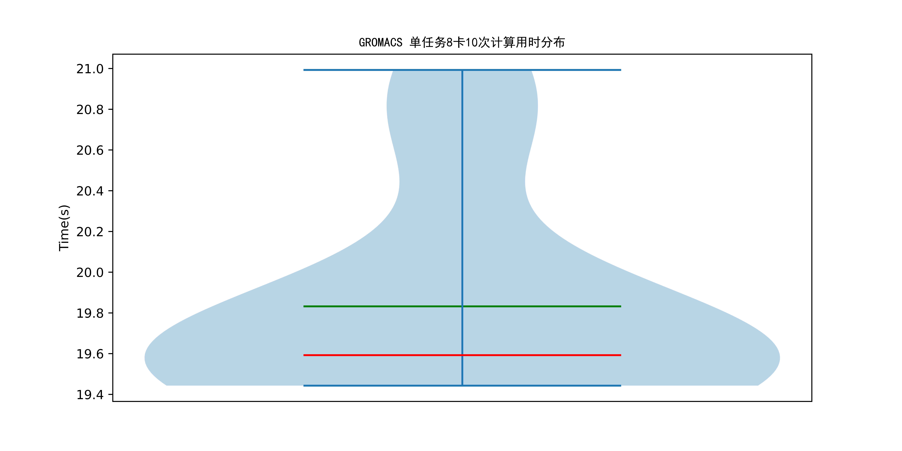  
注：纵坐标为计算用时。小提琴图代表多次测试的计算用时分布，小提琴图越宽的地方代表在该范围内的数据分布密度越高，也就是说越多的数据点集中在这个区间。红线代表多次测试的计算用时的中位数，绿线代表平均值。  

&nbsp;

### 大批量任务并行效率分析：
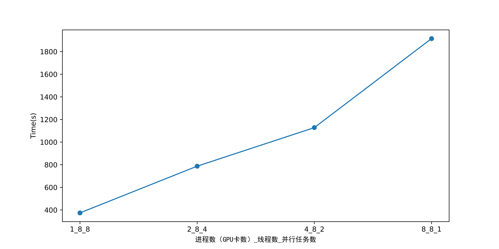  
注：横坐标为不同的进程数×线程数×并行任务数组合，纵坐标为计算总用时，用于对比发现GROMACS大批量任务并行时计算总用时最少的运行模式。进程数代表GROMACS开启的进程数，一个进程使用一张GPU卡，所以进程数可以理解为等价于使用的GPU卡数，因此进程数应<=GPU卡的总数。并行任务数代表同时最多并行的任务数量，最大等于GPU卡数（每个任务使用一张GPU卡），最小为1（每个任务使用全部GPU卡，任务间串行）。线程数代表每个进程使用线程数，通常使得进程数×线程数×并行任务数=CPU核心数能够充分利用到全部的CPU核心发挥最佳性能，因此选用满足以下条件的几种情况进行测试：  
$$
\begin{align*}
进程数\times并行任务数&=GPU卡数\\
进程数\times线程数\times并行任务数&=CPU核心数
\end{align*}
$$
**每个任务使用1张GPU卡，同时最多并行8个任务时计算总用时最少。**  

&nbsp;

### 大批量任务运行特征分析：
  
注：从顶端顺时针一周为软件50个任务并行运行期间各指标使用情况，将各个指标缩放到同一尺度并使用不同比例尺进行对比展示。(包括CPU使用率、 内存使用量、I/O读带宽、I/O写带宽、功耗)  

  
注：从顶端顺时针一周为软件50个任务并行运行期间各指标使用情况，将各个指标缩放到同一尺度并使用不同比例尺进行对比展示。(包括GPU使用率和全部显存使用量)  

  
注：从顶端顺时针一周为软件50个任务并行运行期间各指标使用情况，从内向外不同层级分别展示一个指标的变化情况，每个层级内侧线为0，外侧线为该指标全程的最大值，指标范围见图例。  

&nbsp;
GPU使用率峰值：89.0%，中位数22.5%，平均值44.02%  
显存使用峰值：10.57GB，中位数10.55GB，平均值8.94GB  
CPU使用率峰值：100.0%，中位数99.85%，平均值57.18%  
内存使用峰值：15.94GB，中位数15.46GB，平均值15.02GB  
I/O读峰值速率：14.94MB/s，中位数3.02KB/s，平均值376.29KB/s  
I/O写峰值速率：6.61MB/s，中位数22.37KB/s，平均值395.27KB/s  
功耗峰值：3905.0W，中位数2789.5W，平均值2902.0W  
&nbsp;

### 节点硬件配置性能打分：
测试软件：GROMACS  
单任务性能得分：98.74  
单任务计算用时稳定性得分：97.4  
大批量任务计算用时得分：100.0  
大批量任务计算能耗得分：100.0  
性能综合得分：98.72  

## AMBER
软件版本：24.0  
数据集：1WDN谷氨酰胺结合蛋白在水环境中的模型（61K原子），进行50,000 步（共 100 ps）的 NPT 模拟（恒压恒温），模拟温度为 300 K，压力为 1 atm  
测试硬件配置：GPU型号NVIDIA A100-SXM4-80GB，GPU卡数8，单卡显存80.0GB，CPU型号Intel(R) Xeon(R) Platinum 8358 CPU @ 2.60GHz，CPU核心数64，内存容量1007.52GB。文件系统挂载点/rdxfs，文件系统类型lustre，文件系统可用容量800976.83GB，文件系统使用率48%。  

&nbsp;
测评内容：  
1. 单任务运行特征分析。记录软件计算时对GPU、CPU、内存、I/O读写带宽等资源的使用情况和功耗，输出从任务运行到结束的资源使用情况雷达图，帮助用户了解软件资源需求特征、分析被测节点配置是否存在瓶颈。
2. 单任务并行效率分析。使用不同数量的GPU卡运行相同算例，统计计算用时、GPU卡时和分子动力学模拟性能，计算使用不同数量GPU卡的加速比和计算效率。通过本指标的评测，可以得知计算用时最少的单任务并行策略以及计算卡时最少的单任务并行策略。  

$$
\begin{align}
加速比&=\frac{该GPU卡数的分子动力学模拟性能}{单卡分子动力学模拟性能}\\
计算效率&=\frac{加速比}{GPU卡数}*100\%
\end{align}
$$
3. 单任务计算用时稳定性分析。多次测试相同单任务的计算用时，统计计算用时分布，输出小提琴图。本指标是为了测试被测节点的软硬件环境是否存在较大的性能波动。
4. 大批量任务并行效率分析。使用不同GPU卡数×并行任务数的组合测试计算软件大批量任务并行计算。输出不同运行模式计算用时的折线图，以及在目前节点配置下大批量任务并行时最佳并行模式。通过本指标的评测，可以得知在何种并行策略下大批量任务的计算总用时最少。
5. 大批量任务运行特征分析。记录计算软件在大批量任务并行模式下的GPU、CPU、内存、I/O读写带宽等资源的使用情况和功耗，输出从任务运行到结束的资源使用情况雷达图，帮助用户了解软件在大批量任务并行模式下的资源需求特征、分析被测节点配置是否存在瓶颈。  

&nbsp;
计算当前硬件配置下软件性能得分。本测评根据单任务性能得分、计算用时稳定性得分、大批量任务计算用时得分、大批量任务计算能耗得分等四个细分指标的综合计算，得到单节点的AMBER性能总分。  
$$
总得分=avg(单任务性能得分\times\frac{计算用时稳定性得分}{100}+大批量任务计算用时得分+大批量任务计算能耗得分)
$$
四个细分指标详述如下：  
① 单任务性能得分：根据多次相同单任务的平均分子动力学模拟性能计算。  
$$
单任务性能得分={系数}\times{分子动力学模拟性能}
$$
② 计算用时稳定性：根据多次相同单任务的用时分布计算。  
$$
单任务计算稳定性得分=max((1-\frac{计算用时标准差}{计算用时均值})\times100,0)
$$
③ 大批量任务计算用时得分：根据大批量任务并行的总用时计算。  
$$
大批量任务计算用时得分=系数\times\frac{任务数量}{计算总用时}
$$
④ 大批量任务计算能耗得分：根据大批量任务并行的总能耗计算。  
$$
大批量任务计算能耗得分=系数\times\frac{任务数量}{计算总能耗}
$$
注：系数以一个标准配置为基准（100分）来确定，测试硬件配置的最终得分为相对于标准配置的相对得分。分子动力学模拟性能为分子动力学模拟软件常用的性能指标，单位为ns/day，表示在当前硬件和输入参数条件下每天能够模拟的纳秒数，该值越大代表单位时间内能完成更长时间的分子动力学模拟，代表硬件配置性能更好。  
&nbsp;

### 单任务运行特征分析：
  
注：从顶端顺时针一周为软件单任务运行期间各指标使用情况，将各个指标缩放到同一尺度并使用不同比例尺进行对比展示。(包括CPU使用率、 内存使用量、I/O读带宽、I/O写带宽、功耗)  

  
注：从顶端顺时针一周为软件单任务运行期间各指标使用情况，将各个指标缩放到同一尺度并使用不同比例尺进行对比展示。(包括GPU使用率和全部显存使用量)  

  
注：从顶端顺时针一周为软件单任务运行期间各指标使用情况，从内向外不同层级分别展示一个指标的变化情况，每个层级内侧线为0，外侧线为该指标全程的最大值，指标范围见图例。  

&nbsp;
GPU使用率峰值：61.5%，中位数2.5%，平均值27.25%  
显存使用峰值：34.87GB，中位数33.25GB，平均值26.72GB  
CPU使用率峰值：100.0%，中位数12.2%，平均值11.83%  
内存使用峰值：20.96GB，中位数19.14GB，平均值18.43GB  
I/O读峰值速率：217.12KB/s，中位数2.7KB/s，平均值15.64KB/s  
I/O写峰值速率：3.56MB/s，中位数22.11KB/s，平均值180.69KB/s  
功耗峰值：2874.0W，中位数2086.0W，平均值2362.4W  
&nbsp;

### 单任务并行效率分析：
计算用时：  
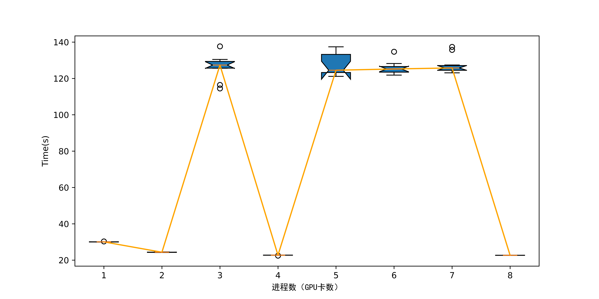  
注：横坐标为不同的进程数（GPU卡数），纵坐标为任务运行时间，用于对比发现AMBER单机多卡并行时计算用时最少的运行模式。进程数代表AMBER开启的进程数，一个进程使用一张GPU卡，所以进程数可以理解为等价于使用的GPU卡数，因此选用进程数<=GPU卡总数的几种情况进行测试。  
**使用8张GPU卡并行计算时计算用时最少。**  
&nbsp;
计算所用GPU卡时：  
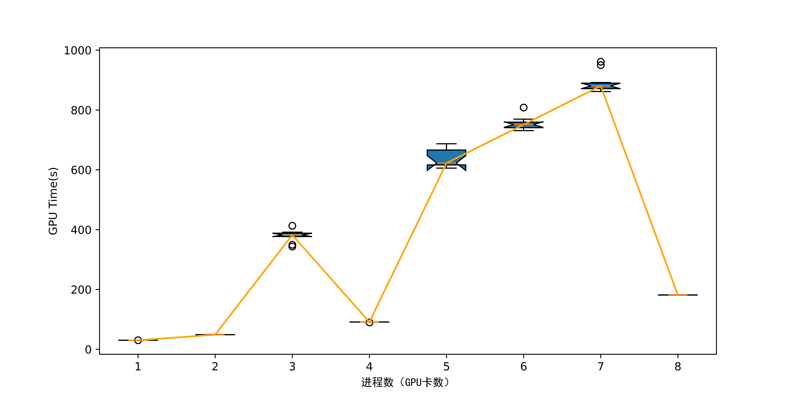  
注：横坐标为不同的进程数（GPU卡数），纵坐标为GPU卡时（GPU卡时=所用GPU数量×计算用时），用于对比发现AMBER单机多卡并行时GPU卡时最少（GPU最经济）的运行模式。进程数代表AMBER开启的进程数，一个进程使用一张GPU卡，所以进程数可以理解为等价于使用的GPU卡数，因此选用进程数<=GPU卡总数的几种情况进行测试。  
**使用1张GPU卡并行计算时GPU卡时最少。**  
&nbsp;
分子动力学模拟性能：  
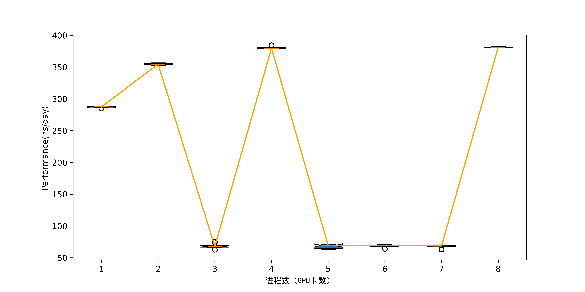  
注：横坐标为不同的进程数（GPU卡数），纵坐标为分子动力学模拟性能，用于对比发现AMBER单机多卡并行时分子动力学模拟性能最高的运行模式。进程数代表AMBER开启的进程数，一个进程使用一张GPU卡，所以进程数可以理解为等价于使用的GPU卡数，因此选用进程数<=GPU卡总数的几种情况进行测试。分子动力学模拟性能为分子动力学模拟软件常用的性能指标，单位为ns/day，表示在当前硬件和输入参数条件下每天能够模拟的纳秒数，该值越大代表单位时间内能完成更长时间的分子动力学模拟，代表硬件配置性能更好。  
**使用8张GPU卡并行计算时分子动力学模拟性能最高。**  
&nbsp;
| 使用的GPU数量 | 分子动力学模拟性能（ns/day） | 加速比 | 计算效率 | 计算用时（s） | GPU卡时（s） |
| ---- | ---- | ---- | ---- | ---- | ---- |
| 1 | 287.44 | 1.0 | 100.0% | 30.06 | 30.06 |
| 2 | 354.69 | 1.23 | 61.7% | 24.36 | 48.72 |
| 3 | 67.84 | 0.24 | 7.87% | 127.36 | 382.1 |
| 4 | 379.85 | 1.32 | 33.04% | 22.74 | 90.98 |
| 5 | 69.39 | 0.24 | 4.83% | 124.52 | 622.6 |
| 6 | 69.0 | 0.24 | 4.0% | 125.2 | 751.23 |
| 7 | 68.69 | 0.24 | 3.41% | 125.78 | 880.46 |
| 8 | 381.02 | 1.33 | 16.57% | 22.68 | 181.4 |

### 单任务计算用时稳定性分析：
使用全部8张GPU卡并行计算相同算例，测试10次，统计用时分布。  
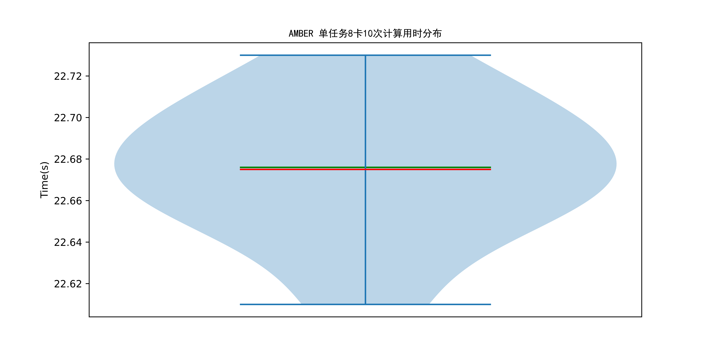  
注：纵坐标为计算用时。小提琴图代表多次测试的计算用时分布，小提琴图越宽的地方代表在该范围内的数据分布密度越高，也就是说越多的数据点集中在这个区间。红线代表多次测试的计算用时的中位数，绿线代表平均值。  

&nbsp;

### 大批量任务并行效率分析：
  
注：横坐标为不同的进程数（GPU卡数）×并行任务数组合，纵坐标为计算总用时，用于对比发现AMBER大批量任务并行时计算总用时最少的运行模式。进程数代表AMBER开启的进程数，一个进程使用一张GPU卡，所以进程数可以理解为等价于使用的GPU卡数，因此进程数应<=GPU卡的总数。并行任务数代表同时最多并行的任务数量，最大等于GPU卡数（每个任务使用一张GPU卡），最小为1（每个任务使用全部GPU卡，任务间串行）。因此选用满足 $进程数×并行任务数=GPU卡数$ 的几种情况进行测试。  
**每个任务使用1张GPU卡，同时最多并行8个任务时计算总用时最少。**  

&nbsp;

### 大批量任务运行特征分析：
  
注：从顶端顺时针一周为软件50个任务并行运行期间各指标使用情况，将各个指标缩放到同一尺度并使用不同比例尺进行对比展示。(包括CPU使用率、 内存使用量、I/O读带宽、I/O写带宽、功耗)  

  
注：从顶端顺时针一周为软件50个任务并行运行期间各指标使用情况，将各个指标缩放到同一尺度并使用不同比例尺进行对比展示。(包括GPU使用率和全部显存使用量)  

  
注：从顶端顺时针一周为软件50个任务并行运行期间各指标使用情况，从内向外不同层级分别展示一个指标的变化情况，每个层级内侧线为0，外侧线为该指标全程的最大值，指标范围见图例。  

&nbsp;
GPU使用率峰值：92.5%，中位数90.38%，平均值54.82%  
显存使用峰值：12.3GB，中位数12.22GB，平均值10.21GB  
CPU使用率峰值：100.0%，中位数12.77%，平均值10.21%  
内存使用峰值：16.45GB，中位数16.23GB，平均值15.25GB  
I/O读峰值速率：146.83MB/s，中位数2.39KB/s，平均值2.63MB/s  
I/O写峰值速率：28.42MB/s，中位数21.64KB/s，平均值1.17MB/s  
功耗峰值：3197.0W，中位数3129.0W，平均值2685.32W  
&nbsp;

### 节点硬件配置性能打分：
测试软件：AMBER  
单任务性能得分：100.17  
单任务计算用时稳定性得分：99.86  
大批量任务计算用时得分：100.0  
大批量任务计算能耗得分：100.0  
性能综合得分：100.01  

## DSDP
软件版本：v1.0  
数据集：包含995对蛋白质和配体的结构文件的测试数据集  
测试硬件配置：GPU型号NVIDIA A100-SXM4-80GB，GPU卡数8，单卡显存80.0GB，CPU型号Intel(R) Xeon(R) Platinum 8358 CPU @ 2.60GHz，CPU核心数64，内存容量1007.52GB。文件系统挂载点/rdxfs，文件系统类型lustre，文件系统可用容量800976.82GB，文件系统使用率48%。  

&nbsp;
测评内容：  
1. 单任务运行特征分析。记录软件计算时对GPU、CPU、内存、I/O读写带宽等资源的使用情况和功耗，输出从任务运行到结束的资源使用情况雷达图，帮助用户了解软件资源需求特征、分析被测节点配置是否存在瓶颈。
2. 单任务计算用时稳定性分析。多次测试相同单任务的计算用时，统计计算用时分布，输出小提琴图。本指标是为了测试被测节点的软硬件环境是否存在较大的性能波动。
3. 大批量任务运行特征分析。记录计算软件在大批量任务并行模式下的GPU、CPU、内存、I/O读写带宽等资源的使用情况和功耗，输出从任务运行到结束的资源使用情况雷达图，帮助用户了解软件在大批量任务并行模式下的资源需求特征、分析被测节点配置是否存在瓶颈。  

&nbsp;
计算当前硬件配置下软件性能得分。本测评根据单任务性能得分、计算用时稳定性得分、大批量任务计算用时得分、大批量任务计算能耗得分等四个细分指标的综合计算，得到单节点的DSDP性能总分。  
$$
总得分=avg(单任务性能得分\times\frac{计算用时稳定性得分}{100}+大批量任务计算用时得分+大批量任务计算能耗得分)
$$
四个细分指标详述如下：  
① 单任务性能得分：根据多次相同单任务的平均分子动力学模拟性能计算。  
$$
单任务性能得分={系数}\times{分子动力学模拟性能}
$$
② 计算用时稳定性：根据多次相同单任务的用时分布计算。  
$$
单任务计算稳定性得分=max((1-\frac{计算用时标准差}{计算用时均值})\times100,0)
$$
③ 大批量任务计算用时得分：根据大批量任务并行的总用时计算。  
$$
大批量任务计算用时得分=系数\times\frac{任务数量}{计算总用时}
$$
④ 大批量任务计算能耗得分：根据大批量任务并行的总能耗计算。  
$$
大批量任务计算能耗得分=系数\times\frac{任务数量}{计算总能耗}
$$
注：系数以一个标准配置为基准（100分）来确定，测试硬件配置的最终得分为相对于标准配置的相对得分。分子动力学模拟性能为分子动力学模拟软件常用的性能指标，单位为ns/day，表示在当前硬件和输入参数条件下每天能够模拟的纳秒数，该值越大代表单位时间内能完成更长时间的分子动力学模拟，代表硬件配置性能更好。  
&nbsp;

### 单任务运行特征分析：
  
注：从顶端顺时针一周为软件单任务运行期间各指标使用情况，将各个指标缩放到同一尺度并使用不同比例尺进行对比展示。(包括CPU使用率、 内存使用量、I/O读带宽、I/O写带宽、功耗)  

  
注：从顶端顺时针一周为软件单任务运行期间各指标使用情况，将各个指标缩放到同一尺度并使用不同比例尺进行对比展示。(包括GPU使用率和全部显存使用量)  

  
注：从顶端顺时针一周为软件单任务运行期间各指标使用情况，从内向外不同层级分别展示一个指标的变化情况，每个层级内侧线为0，外侧线为该指标全程的最大值，指标范围见图例。  

&nbsp;
GPU使用率峰值：12.5%，中位数2.25%，平均值4.53%  
显存使用峰值：9.06GB，中位数9.02GB，平均值8.29GB  
CPU使用率峰值：100.0%，中位数2.34%，平均值2.89%  
内存使用峰值：15.2GB，中位数14.95GB，平均值14.83GB  
I/O读峰值速率：50.89MB/s，中位数43.46KB/s，平均值447.11KB/s  
I/O写峰值速率：450.73MB/s，中位数63.61KB/s，平均值559.51KB/s  
功耗峰值：2059.0W，中位数1989.0W，平均值1984.92W  
&nbsp;

### 单任务计算用时稳定性分析：
相同算例测试10次，统计用时分布。  
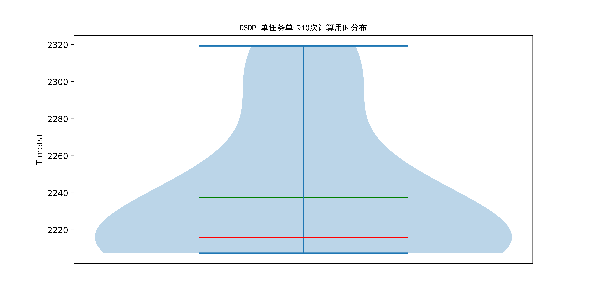  
注：纵坐标为计算用时。小提琴图代表多次测试的计算用时分布，小提琴图越宽的地方代表在该范围内的数据分布密度越高，也就是说越多的数据点集中在这个区间。红线代表多次测试的计算用时的中位数，绿线代表平均值。  

&nbsp;

### 大批量任务运行特征分析：
  
注：从顶端顺时针一周为软件50个任务并行运行期间各指标使用情况，将各个指标缩放到同一尺度并使用不同比例尺进行对比展示。(包括CPU使用率、 内存使用量、I/O读带宽、I/O写带宽、功耗)  

  
注：从顶端顺时针一周为软件50个任务并行运行期间各指标使用情况，将各个指标缩放到同一尺度并使用不同比例尺进行对比展示。(包括GPU使用率和全部显存使用量)  

  
注：从顶端顺时针一周为软件50个任务并行运行期间各指标使用情况，从内向外不同层级分别展示一个指标的变化情况，每个层级内侧线为0，外侧线为该指标全程的最大值，指标范围见图例。  

&nbsp;
GPU使用率峰值：95.5%，中位数1.0%，平均值11.95%  
显存使用峰值：24.65GB，中位数8.92GB，平均值12.85GB  
CPU使用率峰值：100.0%，中位数6.44%，平均值7.5%  
内存使用峰值：27.75GB，中位数21.74GB，平均值22.33GB  
I/O读峰值速率：67.42MB/s，中位数403.91KB/s，平均值665.4KB/s  
I/O写峰值速率：933.71MB/s，中位数125.48KB/s，平均值1.39MB/s  
功耗峰值：2770.0W，中位数2023.0W，平均值2104.06W  
&nbsp;

### 节点硬件配置性能打分：
测试软件：DSDP  
单任务性能得分：109.59  
单任务计算用时稳定性得分：98.29  
大批量任务计算用时得分：100.0  
大批量任务计算能耗得分：100.05  
性能综合得分：102.59  

### 单节点测评总得分:401.35

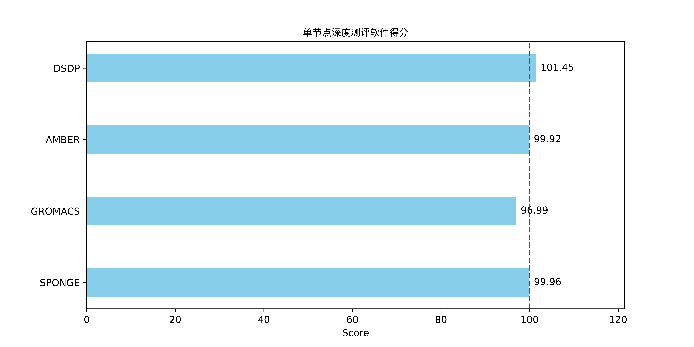  
&nbsp;
#### 测试硬件配置：
GPU型号NVIDIA A100-SXM4-80GB，GPU卡数8，单卡显存80.0GB，CPU型号Intel(R) Xeon(R) Platinum 8358 CPU @ 2.60GHz，CPU核心数64，内存容量1007.52GB。文件系统挂载点/rdxfs，文件系统类型lustre，文件系统可用容量800976.81GB，文件系统使用率48%。  
&nbsp;
#### SPONGE
软件版本：v1.4  
数据集：https://doi.org/10.5281/zenodo.12200627 夏 义杰. Test Data for Comparing Simulation Speed between SPONGE and AMBER. Zenodo; 2024.  
&nbsp;
#### GROMACS
软件版本：2023.3  
数据集：1WDN谷氨酰胺结合蛋白在水环境中的模型（61K原子），进行50,000 步（共 100 ps）的 NPT 模拟（恒压恒温），模拟温度为 300 K，压力为 1 atm  
&nbsp;
#### AMBER
软件版本：24.0  
数据集：1WDN谷氨酰胺结合蛋白在水环境中的模型（61K原子），进行50,000 步（共 100 ps）的 NPT 模拟（恒压恒温），模拟温度为 300 K，压力为 1 atm  
&nbsp;
#### DSDP
软件版本：v1.0  
数据集：包含995对蛋白质和配体的结构文件的测试数据集  
&nbsp;
