# 集群测评报告
针对生命科学计算的高性能集群性能分析及评测框架，使用代表性生物学计算软件集合，通过Qmon监控软件对运行时CPU、内存、IO等资源需求特征进行监控，使用计算用时、计算效率、CPU核时等关键评价指标对集群性能进行测评和打分，帮助指导生命科学计算集群的建设、提升生命科学计算生产效率。  
在运行集群测评之前，建议先进行单节点深度测评，了解软件运行特征和最高效的运行模式，使用每款软件最高效的运行模式进行集群测评。集群测评模式对每款计算软件在集群大规模并行计算时的运行特征、计算效率进行分析，用于评估计算软件在目前集群配置下运行是否存在瓶颈以及计算软件在目前集群配置下的计算效率。  
每款软件包括以下结果：  
1. 集群资源使用情况分析。使用Qmon监控软件记录计算软件在集群大规模计算时的资源使用情况，分析CPU、内存、I/O读写带宽的使用情况，输出计算软件计算全程的资源使用情况雷达图。每款计算软件会输出两张雷达图，第一张图是将各个指标缩放到0-100并在同一比例尺下对比展示，第二张图将雷达图分成若干层级，从内向外不同层级分别展示一个指标的变化情况。两幅图的指标和数据都是相同的，都是从顶端顺时针方向为起始，只是展示形式不同。
2. 集群大规模并行计算打分。  
$$
计算用时得分=系数×\frac{任务数量}{计算用时}  
$$
若测试平台支持功耗统计，则  
$$
\begin{align*}
能耗得分&=系数×\frac{任务数量}{集群总能耗}\\
综合得分&=\frac{计算用时得分+能耗得分}{2}  
\end{align*}
$$
若测试平台不支持功耗统计，则计算用时得分即软件最终得分。  
系数以目前测试的主流配置为基准（100分）来确定，得分是一个相对值且没有上限。  

报告最终会计算总得分，总得分为各软件得分之和。  
&nbsp;
&nbsp;

## BWA
软件版本：0.7.18-r1243-dirty  
数据集：千人基因组计划个体NA12750全基因组测序（4.8GB）；参考基因组：NCBI36（3.0GB）  
测试集群硬件配置：测试集群节点数量8，CPU型号Intel(R) Xeon(R) Gold 6330 CPU @ 2.00GHz，CPU核心数56，内存容量503.53GB。文件系统挂载点/rdxfs，文件系统类型lustre，文件系统可用容量194500.2GB，文件系统使用率88%。  
### 集群资源使用情况分析：
测试软件：BWA  
并行模式：14线程  
任务量：400  
  
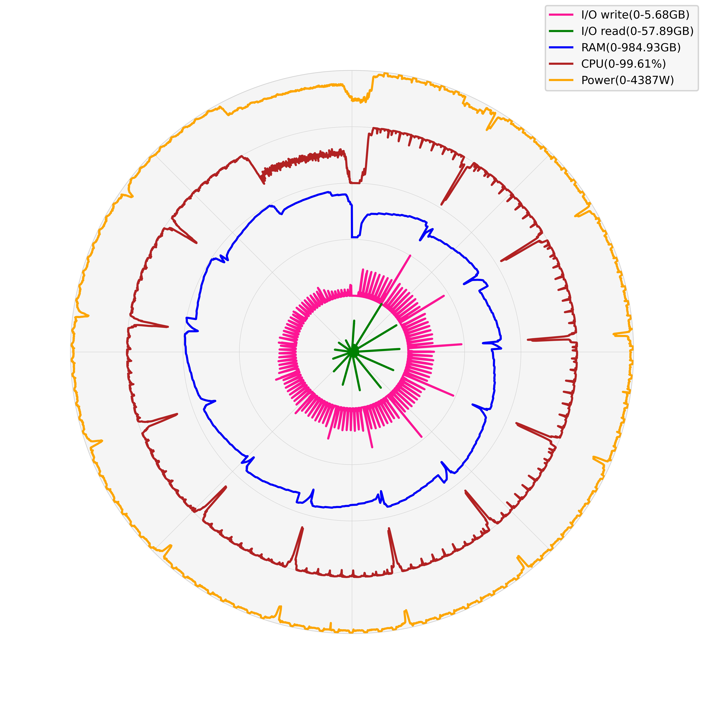  
平均CPU使用率峰值：99.61%，中位数98.41%，平均值91.27%  
内存使用峰值：984.93GB，中位数723.91GB，平均值710.39GB  
I/O读峰值速率：57.89GB，中位数0.0GB，平均值0.75GB  
I/O写峰值速率：5.68GB，中位数0.09GB，平均值0.37GB  
功耗峰值：4387W，中位数4154W，平均值4054W  
&nbsp;
计算用时得分：104.28
功耗得分：106.0
#### 集群大规模并行计算得分：105.14

## SPAdes
软件版本：v4.0.0  
数据集：大肠杆菌K-12菌株MG1655基因组测序（6.1GB）  
测试集群硬件配置：测试集群节点数量8，CPU型号Intel(R) Xeon(R) Gold 6330 CPU @ 2.00GHz，CPU核心数56，内存容量503.53GB。文件系统挂载点/rdxfs，文件系统类型lustre，文件系统可用容量194500.2GB，文件系统使用率88%。  
### 集群资源使用情况分析：
测试软件：SPAdes  
并行模式：2线程  
任务量：400  
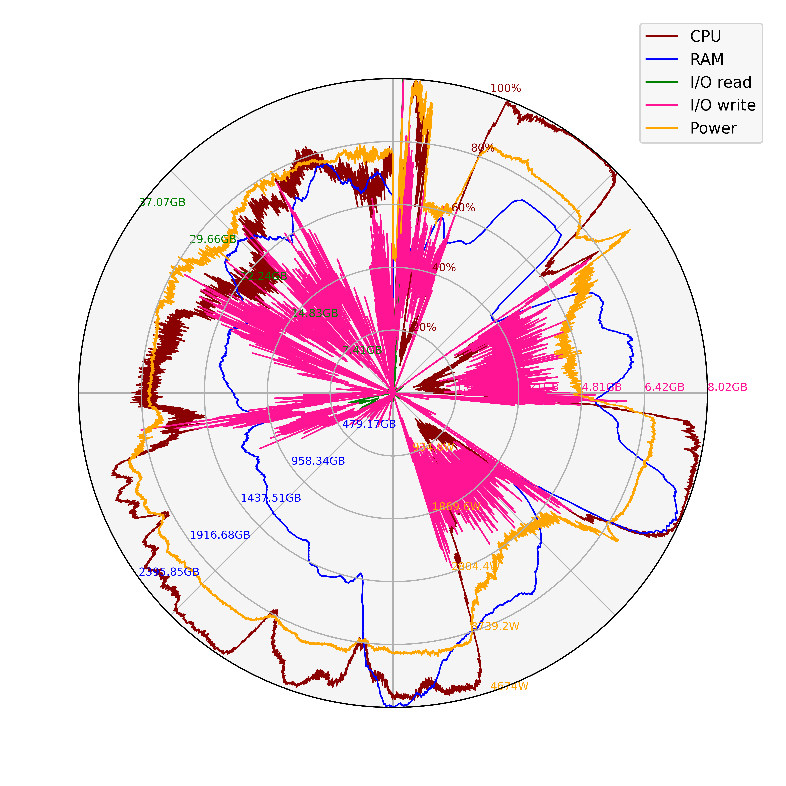  
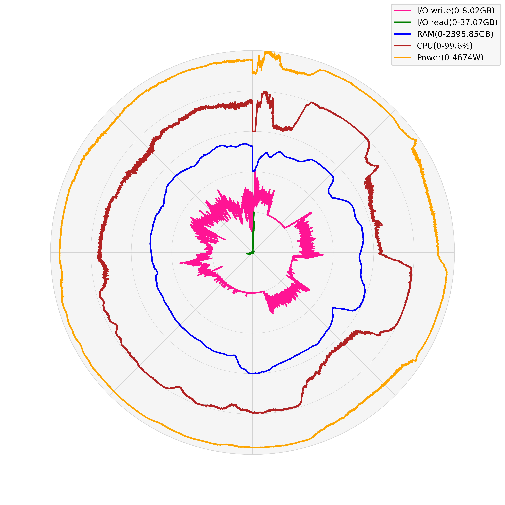  
平均CPU使用率峰值：99.6%，中位数72.27%，平均值66.12%  
内存使用峰值：2395.85GB，中位数1428.71GB，平均值1393.05GB  
I/O读峰值速率：37.07GB，中位数0.44GB，平均值0.66GB  
I/O写峰值速率：8.02GB，中位数0.31GB，平均值1.28GB  
功耗峰值：4674W，中位数3607W，平均值3500W  
&nbsp;
计算用时得分：103.38
功耗得分：98.46
#### 集群大规模并行计算得分：100.92

## Bismark
软件版本：v0.24.2  
数据集：IMR90细胞系全基因组shotgun-bisulfite测序（4.0GB）；参考基因组NCBI36（3.0GB）  
测试集群硬件配置：测试集群节点数量8，CPU型号Intel(R) Xeon(R) Gold 6330 CPU @ 2.00GHz，CPU核心数56，内存容量503.53GB。文件系统挂载点/rdxfs，文件系统类型lustre，文件系统可用容量194500.2GB，文件系统使用率88%。  
### 集群资源使用情况分析：
测试软件：Bismark  
并行模式：1线程  
任务量：400  
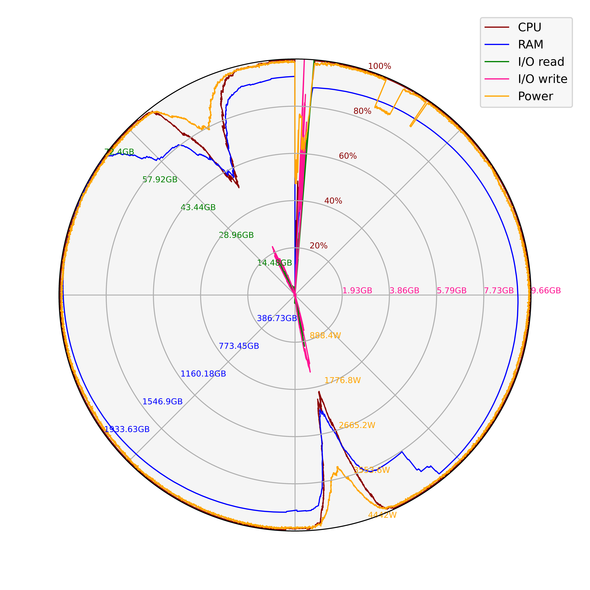  
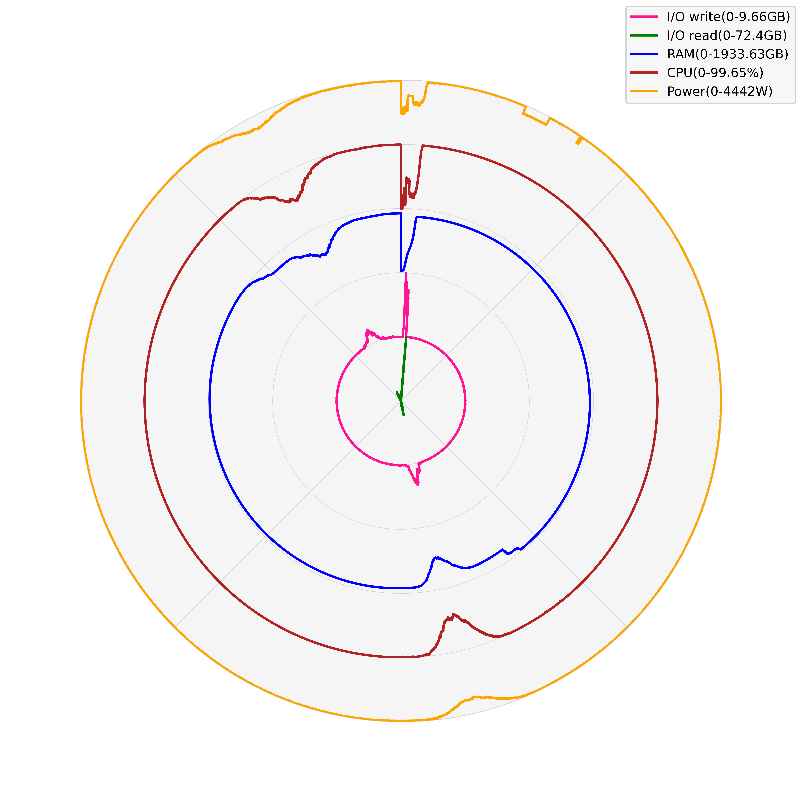  
平均CPU使用率峰值：99.65%，中位数99.6%，平均值84.62%  
内存使用峰值：1933.63GB，中位数1775.68GB，平均值1558.16GB  
I/O读峰值速率：72.4GB，中位数0.28GB，平均值0.48GB  
I/O写峰值速率：9.66GB，中位数0.01GB，平均值0.09GB  
功耗峰值：4442W，中位数4384W，平均值4080W  
&nbsp;
计算用时得分：92.23
功耗得分：96.89
#### 集群大规模并行计算得分：94.56

## STAR
软件版本：2.7.11b  
数据集：小鼠胚胎LINE1抑制后RNA-seq测序（11GB）；参考基因组GRCm39（2.6GB）  
测试集群硬件配置：测试集群节点数量8，CPU型号Intel(R) Xeon(R) Gold 6330 CPU @ 2.00GHz，CPU核心数56，内存容量503.53GB。文件系统挂载点/rdxfs，文件系统类型lustre，文件系统可用容量194500.2GB，文件系统使用率88%。  
### 集群资源使用情况分析：
测试软件：STAR  
并行模式：8线程  
任务量：400  
  
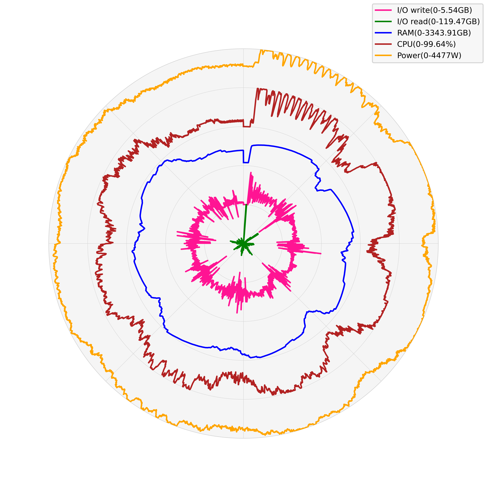  
平均CPU使用率峰值：99.64%，中位数71.65%，平均值64.56%  
内存使用峰值：3343.91GB，中位数2507.38GB，平均值2395.53GB  
I/O读峰值速率：119.47GB，中位数1.65GB，平均值4.45GB  
I/O写峰值速率：5.54GB，中位数1.56GB，平均值1.45GB  
功耗峰值：4477W，中位数3867W，平均值3718W  
&nbsp;
计算用时得分：154.99
功耗得分：94.02
#### 集群大规模并行计算得分：124.5

## Cellranger
软件版本：8.0.1  
数据集：人外周血单核细胞（PBMC）的1000个细胞的单细胞测序数据，包含淋巴细胞（T细胞、B细胞和NK细胞）和单核细胞（5.17GB）；参考基因组GRCh38（11GB）  
测试集群硬件配置：测试集群节点数量8，CPU型号Intel(R) Xeon(R) Gold 6330 CPU @ 2.00GHz，CPU核心数56，内存容量503.53GB。文件系统挂载点/rdxfs，文件系统类型lustre，文件系统可用容量194500.2GB，文件系统使用率88%。  
### 集群资源使用情况分析：
测试软件：Cellranger  
并行模式：8线程  
任务量：400  
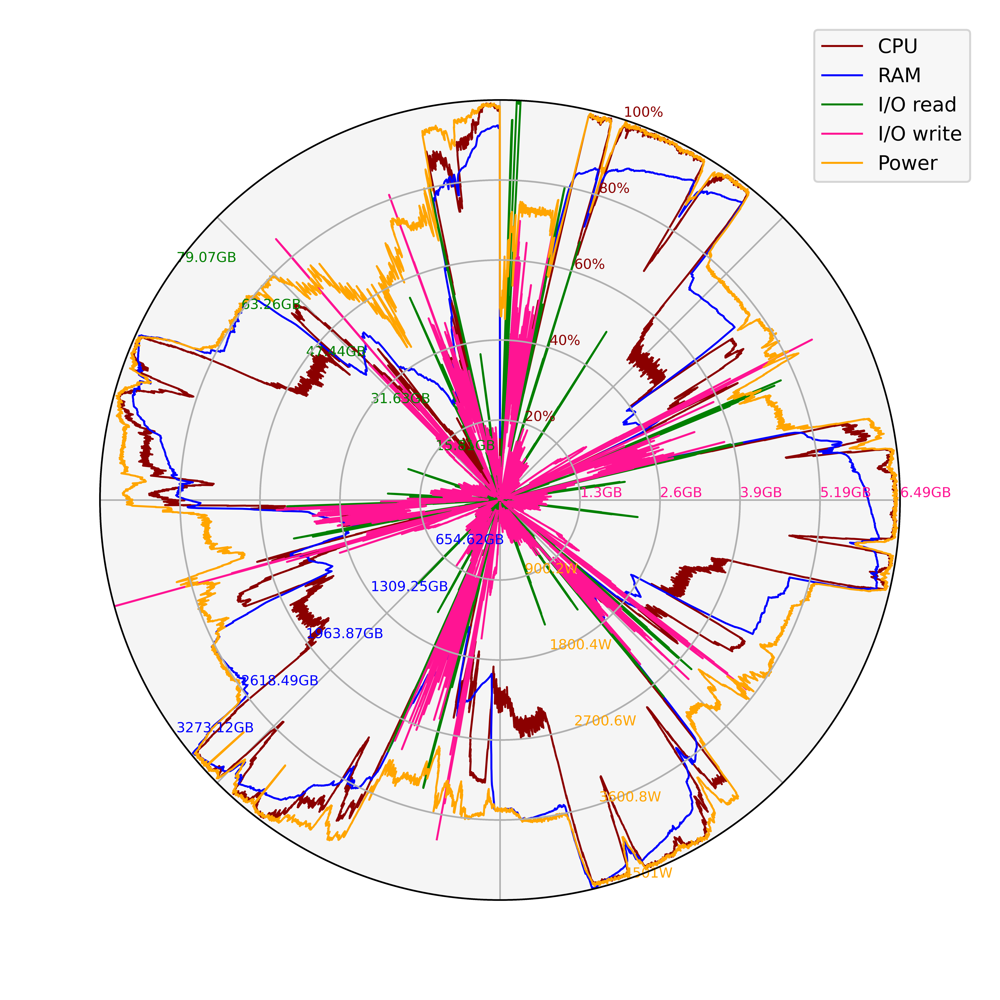  
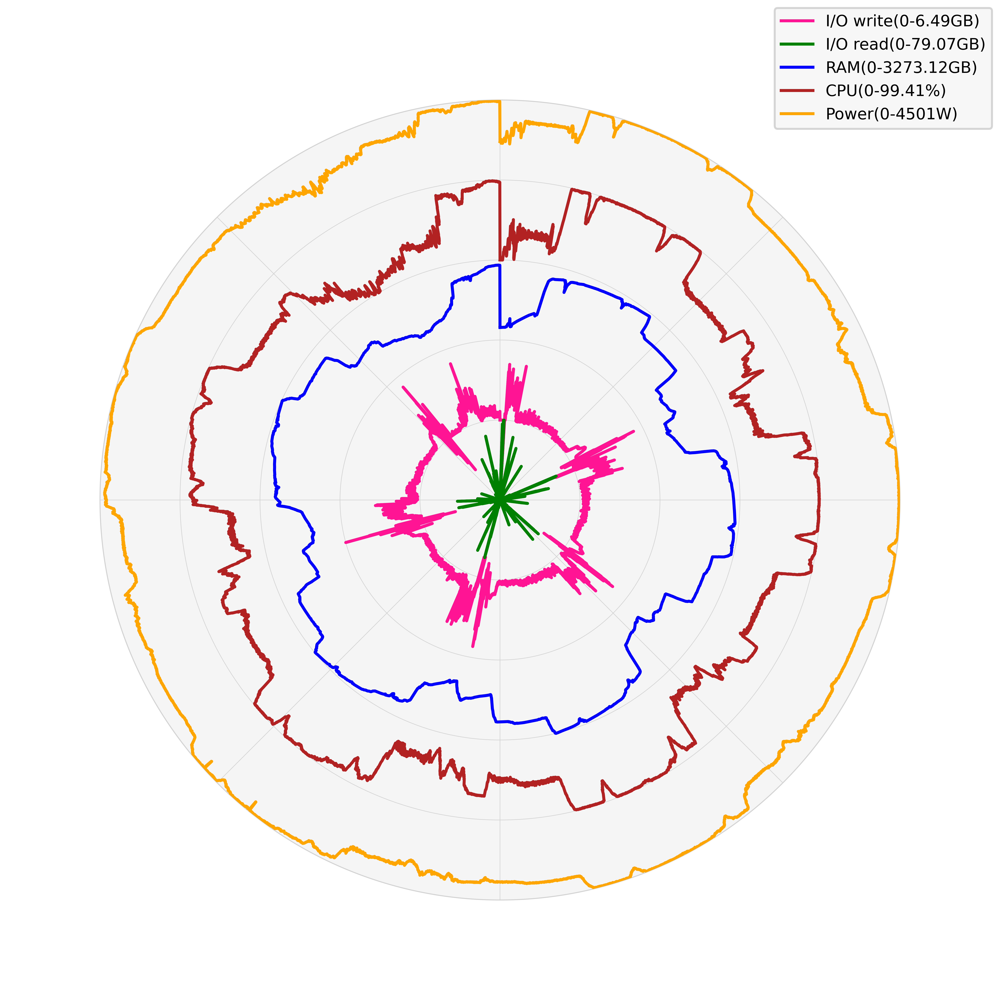  
平均CPU使用率峰值：99.41%，中位数56.01%，平均值58.47%  
内存使用峰值：3273.12GB，中位数2342.18GB，平均值2051.59GB  
I/O读峰值速率：79.07GB，中位数0.69GB，平均值3.02GB  
I/O写峰值速率：6.49GB，中位数0.43GB，平均值0.63GB  
功耗峰值：4501W，中位数3579.0W，平均值3626W  
&nbsp;
计算用时得分：116.73
功耗得分：186.72
#### 集群大规模并行计算得分：151.72

## GATK
软件版本：v4.6.0.0  
数据集：千人基因组计划个体NA12750全基因组测序比对数据（4.7GB）；参考基因组GRCh38（3.1GB）  
测试集群硬件配置：测试集群节点数量8，CPU型号Intel(R) Xeon(R) Gold 6330 CPU @ 2.00GHz，CPU核心数56，内存容量503.53GB。文件系统挂载点/rdxfs，文件系统类型lustre，文件系统可用容量194500.2GB，文件系统使用率88%。  
### 集群资源使用情况分析：
测试软件：GATK  
并行模式：1线程  
任务量：400  
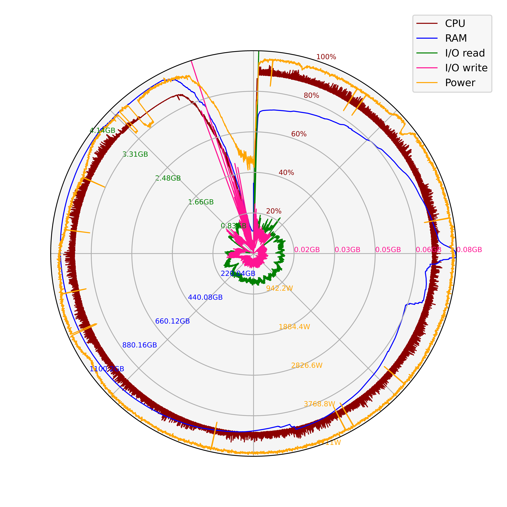  
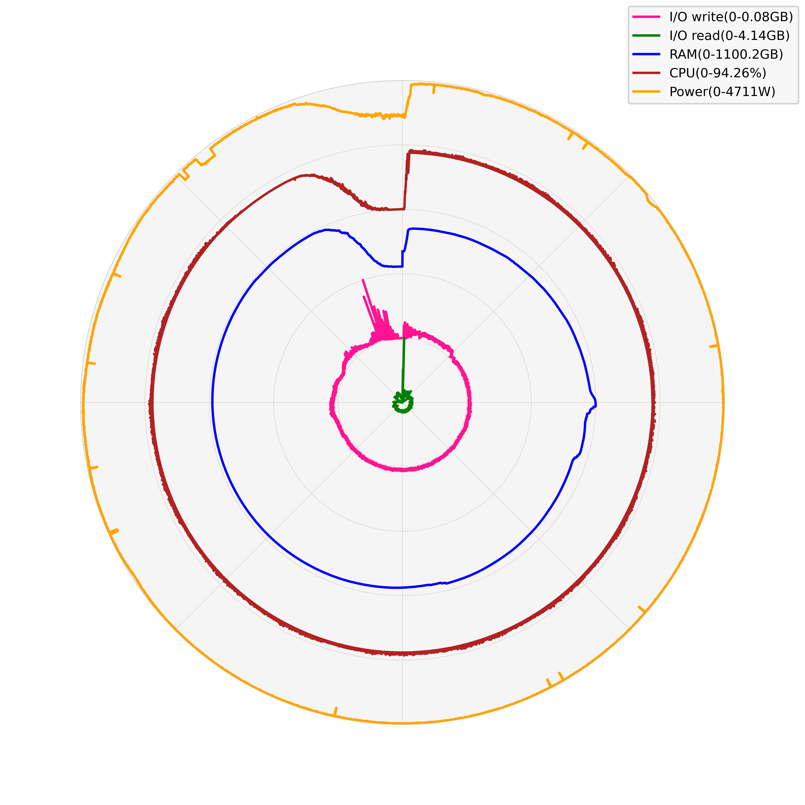  
平均CPU使用率峰值：94.26%，中位数88.96%，平均值85.17%  
内存使用峰值：1100.2GB，中位数971.16GB，平均值932.68GB  
I/O读峰值速率：4.14GB，中位数0.55GB，平均值0.5GB  
I/O写峰值速率：0.08GB，中位数0.0GB，平均值0.0GB  
功耗峰值：4711W，中位数4610.0W，平均值4464W  
&nbsp;
计算用时得分：207.12
功耗得分：105.45
#### 集群大规模并行计算得分：156.28

### 集群测评总得分:733.12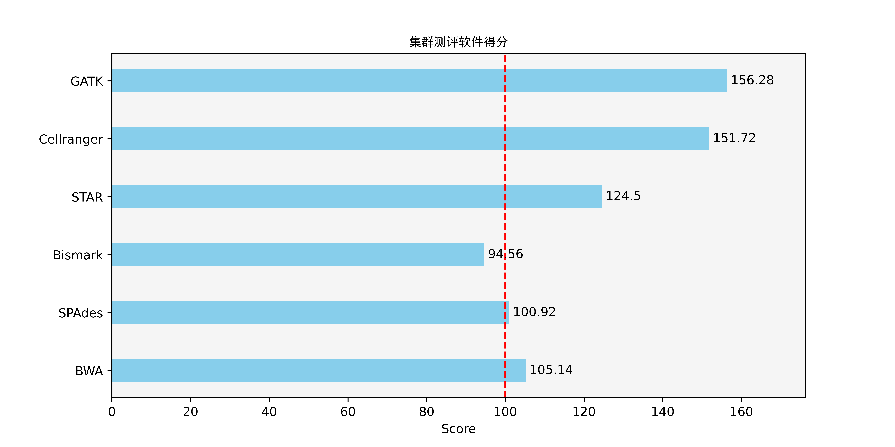  
&nbsp;
#### 测试硬件配置：
测试集群节点数量8，CPU型号Intel(R) Xeon(R) Gold 6330 CPU @ 2.00GHz，CPU核心数56，内存容量503.53GB。文件系统挂载点/rdxfs，文件系统类型lustre,文件系统可用容量194500.2GB，文件系统使用率88%。  
&nbsp;
#### BWA
软件版本：0.7.18-r1243-dirty  
数据集：千人基因组计划个体NA12750全基因组测序（4.8GB）；参考基因组：NCBI36（3.0GB）  
&nbsp;
#### SPAdes
软件版本：v4.0.0  
数据集：大肠杆菌K-12菌株MG1655基因组测序（6.1GB）  
&nbsp;
#### Bismark
软件版本：v0.24.2  
数据集：IMR90细胞系全基因组shotgun-bisulfite测序（4.0GB）；参考基因组NCBI36（3.0GB）  
&nbsp;
#### STAR
软件版本：2.7.11b  
数据集：小鼠胚胎LINE1抑制后RNA-seq测序（11GB）；参考基因组GRCm39（2.6GB）  
&nbsp;
#### Cellranger
软件版本：8.0.1  
数据集：人外周血单核细胞（PBMC）的1000个细胞的单细胞测序数据，包含淋巴细胞（T细胞、B细胞和NK细胞）和单核细胞（5.17GB）；参考基因组GRCh38（11GB）  
&nbsp;
#### GATK
软件版本：v4.6.0.0  
数据集：千人基因组计划个体NA12750全基因组测序比对数据（4.7GB）；参考基因组GRCh38（3.1GB）  
&nbsp;
