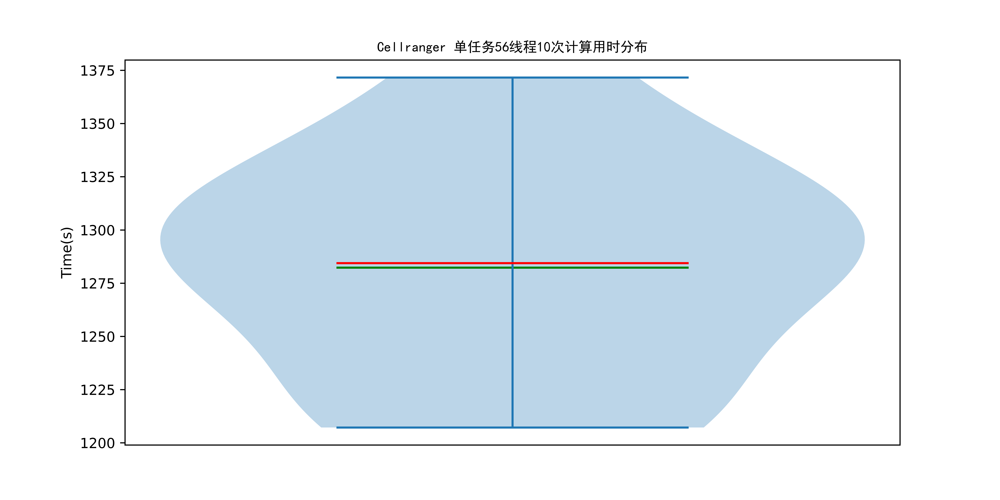
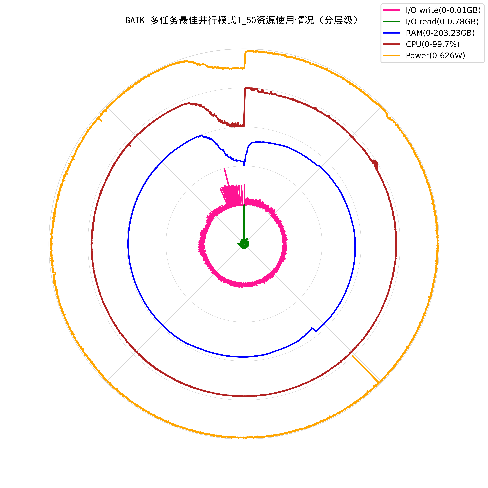

# 单节点深度测评报告

针对生命科学计算的高性能集群性能分析及评测框架，使用代表性生物学计算软件集合，通过Prometheus监控软件对运行时CPU、内存、IO等资源需求特征进行监控，使用计算用时、计算效率、CPU核时等关键评价指标对集群性能进行测评和打分，帮助指导生命科学计算集群的建设、提升生命科学计算生产效率。  
单节点深度测评模式对每款计算软件的运行特征、运行模式进行分析，用于评估计算软件在目前节点配置下运行是否存在瓶颈、分析在目前节点配置下最高效的运行模式。  

每款软件包括以下分析：  
1. 软件运行特征分析。使用Prometheus监控软件记录计算软件使用全部CPU核心时的运行特征，分析CPU、内存、I/O读写带宽的使用情况，输出计算软件一次计算全程的资源使用情况雷达图。每款计算软件的单任务运行特征分析会输出两张雷达图，第一张图是将各个指标缩放到0-100并在同一比例尺下对比展示，第二张图将雷达图分成若干层级，从内向外不同层级分别展示一个指标的变化情况。两幅图的指标和数据都是相同的，都是从顶端顺时针方向为起始，只是展示形式不同。
2. 单任务不同线程加速比分析。使用不同线程数运行计算软件，统计计算用时，输出不同线程数计算用时的折线图。统计CPU核时（计算用时×线程数），输出不同线程数计算CPU核时的折线图。统计不同线程数计算的加速比和计算效率。  
$$
\begin{align*}
加速比&=\frac{单线程计算用时}{该线程数计算用时}\\
计算效率&=\frac{加速比}{线程数}*100\%
\end{align*}
$$
3. 多任务并行模式分析。使用不同CPU核心数×并行任务数的组合测试计算软件多任务并行通量，输出不同运行模式计算用时的折线图。提供在目前节点配置下多任务并行时最佳的运行模式和节点配置得分。  
$$
\begin{align*}
计算用时得分&=系数×\frac{任务数量}{最佳并行模式计算用时}  
\end{align*}
$$
系数以目前测试的主流配置为基准（100分）来确定，得分是一个相对值且没有上限。  
4. 多任务并行资源使用情况分析。使用Qmon监控软件记录计算软件在最佳并行模式下的资源使用情况，分析CPU、内存、I/O读写带宽的使用情况和功耗（部分平台暂不支持功耗统计），输出雷达图，计算能耗得分。（雷达图的说明同单任务运行特征分析）  
$$
\begin{align*}
能耗得分&=系数×\frac{任务数量}{最佳并行模式能耗}  
\end{align*}
$$
5. 计算用时稳定性分析。多次测试单任务使用全部CPU核心的计算用时，统计多次测试结果的分布，输出小提琴图和计算用时稳定性得分。  
$$
\begin{align*}
计算用时稳定性得分=max((1-\frac{标准差}{均值})*100,0)  
\end{align*}
$$
每款软件最后会有一个综合得分  
$$
\begin{align*}
综合得分=\frac{计算用时得分+能耗得分}{2}×\frac{计算用时稳定性得分}{100}  
\end{align*}
$$
部分平台暂不支持功耗统计，没有能耗得分，则  
$$
\begin{align*}
综合得分=计算用时得分×\frac{计算用时稳定性得分}{100}  
\end{align*}
$$
报告最终会计算总得分，总得分为各软件综合得分之和。  
&nbsp;
&nbsp;

## BWA
软件版本：0.7.18-r1243-dirty  
数据集：千人基因组计划个体NA12750全基因组测序（4.8GB）；参考基因组：NCBI36（3.0GB）  
测试硬件配置：CPU型号Intel(R) Xeon(R) Gold 6330 CPU @ 2.00GHz，CPU核心数56，内存容量503.53GB。文件系统挂载点/rdxfs，文件系统类型lustre，文件系统可用容量194500.17GB，文件系统使用率88%。  

### 运行特征分析：
  

  
CPU使用率峰值：99.6%，中位数69.8%，平均值69.63%  
内存使用峰值：47.41GB，中位数41.52GB，平均值36.08GB  
I/O读峰值速率：1.86GB，中位数0.0GB，平均值0.06GB  
I/O写峰值速率：0.35GB，中位数0.0GB，平均值0.03GB  
功耗峰值：548W，中位数471W，平均值460.72W  
&nbsp;

### 单任务不同线程加速比分析：
  
  
&nbsp;
| 线程数 | 计算用时（s） | 加速比 | 计算效率 | CPU核时（s） |
| ---- | ---- | ---- | ---- | ---- |
| 1 | 5230.01 | 1.0 | 100.0% | 5230.01 |
| 2 | 2581.59 | 2.03 | 101.29% | 5163.17 |
| 3 | 1722.68 | 3.04 | 101.2% | 5168.03 |
| 4 | 1298.41 | 4.03 | 100.7% | 5193.66 |
| 5 | 1103.57 | 4.74 | 94.78% | 5517.84 |
| 6 | 921.77 | 5.67 | 94.56% | 5530.62 |
| 7 | 800.41 | 6.53 | 93.34% | 5602.89 |
| 8 | 706.93 | 7.4 | 92.48% | 5655.48 |
| 16 | 372.19 | 14.05 | 87.83% | 5954.96 |
| 32 | 200.51 | 26.08 | 81.51% | 6416.48 |
| 56 | 150.68 | 34.71 | 61.98% | 8438.19 |
### 多任务并行模式分析：
  
最佳并行模式为14线程，得分为83.45。  
&nbsp;

### 多任务并行资源使用情况分析：
  

  
CPU使用率峰值：99.7%，中位数98.4%，平均值92.61%  
内存使用峰值：262.18GB，中位数192.86GB，平均值177.37GB  
I/O读峰值速率：4.5GB，中位数0.0GB，平均值0.09GB  
I/O写峰值速率：0.52GB，中位数0.0GB，平均值0.05GB  
功耗峰值：544W，中位数519W，平均值508.88W  
能耗得分：103.39  
&nbsp;

### 计算用时稳定性分析：
  
计算用时稳定性得分:98.54  
#### BWA总得分:92.06  
&nbsp;
&nbsp;

## SPAdes
软件版本：v4.0.0  
数据集：大肠杆菌K-12菌株MG1655基因组测序（6.1GB）  
测试硬件配置：CPU型号Intel(R) Xeon(R) Gold 6330 CPU @ 2.00GHz，CPU核心数56，内存容量503.53GB。文件系统挂载点/rdxfs，文件系统类型lustre，文件系统可用容量194500.17GB，文件系统使用率88%。  

### 运行特征分析：
  

  
CPU使用率峰值：99.6%，中位数36.9%，平均值48.83%  
内存使用峰值：42.69GB，中位数15.0GB，平均值15.88GB  
I/O读峰值速率：0.56GB，中位数0.0GB，平均值0.03GB  
I/O写峰值速率：1.92GB，中位数0.0GB，平均值0.05GB  
功耗峰值：575W，中位数359.0W，平均值375.08W  
&nbsp;

### 单任务不同线程加速比分析：
  
  
&nbsp;
| 线程数 | 计算用时（s） | 加速比 | 计算效率 | CPU核时（s） |
| ---- | ---- | ---- | ---- | ---- |
| 1 | 7972.45 | 1.0 | 100.0% | 7972.45 |
| 2 | 4219.61 | 1.89 | 94.47% | 8439.21 |
| 3 | 2908.27 | 2.74 | 91.38% | 8724.82 |
| 4 | 2332.92 | 3.42 | 85.43% | 9331.69 |
| 5 | 1912.28 | 4.17 | 83.38% | 9561.42 |
| 6 | 1882.05 | 4.24 | 70.6% | 11292.32 |
| 7 | 1650.4 | 4.83 | 69.01% | 11552.78 |
| 8 | 1522.56 | 5.24 | 65.45% | 12180.45 |
| 16 | 971.39 | 8.21 | 51.3% | 15542.22 |
| 32 | 736.78 | 10.82 | 33.81% | 23576.83 |
| 56 | 671.38 | 11.87 | 21.2% | 37597.5 |
### 多任务并行模式分析：
  
最佳并行模式为2线程，得分为87.36。  
&nbsp;

### 多任务并行资源使用情况分析：
  

  
CPU使用率峰值：99.7%，中位数82.7%，平均值81.94%  
内存使用峰值：352.1GB，中位数166.19GB，平均值175.98GB  
I/O读峰值速率：5.03GB，中位数0.07GB，平均值0.1GB  
I/O写峰值速率：2.0GB，中位数0.0GB，平均值0.09GB  
功耗峰值：606W，中位数470.0W，平均值471.12W  
能耗得分：107.73  
&nbsp;

### 计算用时稳定性分析：
  
计算用时稳定性得分:98.94  
#### SPAdes总得分:96.51  
&nbsp;
&nbsp;

## Bismark
软件版本：v0.24.2  
数据集：IMR90细胞系全基因组shotgun-bisulfite测序（4.0GB）；参考基因组NCBI36（3.0GB）  
测试硬件配置：CPU型号Intel(R) Xeon(R) Gold 6330 CPU @ 2.00GHz，CPU核心数56，内存容量503.53GB。文件系统挂载点/rdxfs，文件系统类型lustre，文件系统可用容量194500.17GB，文件系统使用率88%。  

### 运行特征分析：
  

  
CPU使用率峰值：99.7%，中位数99.6%，平均值73.64%  
内存使用峰值：117.51GB，中位数115.82GB，平均值88.07GB  
I/O读峰值速率：12.59GB，中位数0.03GB，平均值0.34GB  
I/O写峰值速率：1.22GB，中位数0.0GB，平均值0.02GB  
功耗峰值：552W，中位数538.0W，平均值478.64W  
&nbsp;

### 单任务不同线程加速比分析：
  
  
&nbsp;
| 线程数 | 计算用时（s） | 加速比 | 计算效率 | CPU核时（s） |
| ---- | ---- | ---- | ---- | ---- |
| 1 | 4195.24 | 1.0 | 100.0% | 16780.98 |
| 2 | 2183.43 | 1.92 | 96.07% | 17467.46 |
| 3 | 1603.18 | 2.62 | 87.23% | 19238.12 |
| 4 | 1250.1 | 3.36 | 83.9% | 20001.54 |
| 5 | 1028.38 | 4.08 | 81.59% | 20567.62 |
| 6 | 887.96 | 4.72 | 78.74% | 21311.09 |
| 7 | 804.87 | 5.21 | 74.46% | 22536.47 |
| 8 | 678.07 | 6.19 | 77.34% | 21698.14 |
| 14 | 473.56 | 8.86 | 63.28% | 26519.08 |
### 多任务并行模式分析：
  
最佳并行模式为1线程，得分为76.63。  
&nbsp;

### 多任务并行资源使用情况分析：
  

  
CPU使用率峰值：100.0%，中位数99.6%，平均值87.19%  
内存使用峰值：234.16GB，中位数215.75GB，平均值193.62GB  
I/O读峰值速率：12.59GB，中位数0.03GB，平均值0.06GB  
I/O写峰值速率：1.27GB，中位数0.0GB，平均值0.01GB  
功耗峰值：565W，中位数550.0W，平均值523.67W  
能耗得分：93.81  
&nbsp;

### 计算用时稳定性分析：
  
计算用时稳定性得分:98.94  
#### Bismark总得分:84.32  
&nbsp;
&nbsp;

## STAR
软件版本：2.7.11b  
数据集：小鼠胚胎LINE1抑制后RNA-seq测序（11GB）；参考基因组GRCm39（2.6GB）  
测试硬件配置：CPU型号Intel(R) Xeon(R) Gold 6330 CPU @ 2.00GHz，CPU核心数56，内存容量503.53GB。文件系统挂载点/rdxfs，文件系统类型lustre，文件系统可用容量194500.17GB，文件系统使用率88%。  

### 运行特征分析：
  

  
CPU使用率峰值：59.7%，中位数25.1%，平均值23.88%  
内存使用峰值：84.72GB，中位数67.25GB，平均值65.53GB  
I/O读峰值速率：2.83GB，中位数0.06GB，平均值0.19GB  
I/O写峰值速率：1.02GB，中位数0.07GB，平均值0.07GB  
功耗峰值：391W，中位数383W，平均值366.63W  
&nbsp;

### 单任务不同线程加速比分析：
  
  
&nbsp;
32线程任务失败，请检查任务输出日志log/SingleNodeMode/STAR/test_32.log。  
56线程任务失败，请检查任务输出日志log/SingleNodeMode/STAR/test_56.log。  
| 线程数 | 计算用时（s） | 加速比 | 计算效率 | CPU核时（s） |
| ---- | ---- | ---- | ---- | ---- |
| 1 | 3064.7 | 1.0 | 100.0% | 3064.7 |
| 2 | 1563.88 | 1.96 | 97.98% | 3127.76 |
| 3 | 1050.69 | 2.92 | 97.23% | 3152.06 |
| 4 | 798.4 | 3.84 | 95.96% | 3193.6 |
| 5 | 666.01 | 4.6 | 92.03% | 3330.04 |
| 6 | 559.62 | 5.48 | 91.27% | 3357.71 |
| 7 | 494.59 | 6.2 | 88.52% | 3462.12 |
| 8 | 446.67 | 6.86 | 85.77% | 3573.35 |
| 16 | 280.12 | 10.94 | 68.38% | 4481.92 |
### 多任务并行模式分析：
  
最佳并行模式为7线程，得分为80.66。  
&nbsp;

### 多任务并行资源使用情况分析：
  

  
CPU使用率峰值：99.7%，中位数99.2%，平均值83.13%  
内存使用峰值：461.31GB，中位数350.77GB，平均值331.88GB  
I/O读峰值速率：16.0GB，中位数0.19GB，平均值0.71GB  
I/O写峰值速率：1.85GB，中位数0.25GB，平均值0.24GB  
功耗峰值：565W，中位数553.0W，平均值515.24W  
能耗得分：102.16  
&nbsp;

### 计算用时稳定性分析：
  
计算用时稳定性得分:97.22  
#### STAR总得分:88.87  
&nbsp;
&nbsp;

## Cellranger
软件版本：8.0.1  
数据集：人外周血单核细胞（PBMC）的1000个细胞的单细胞测序数据，包含淋巴细胞（T细胞、B细胞和NK细胞）和单核细胞（5.17GB）；参考基因组GRCh38（11GB）  
测试硬件配置：CPU型号Intel(R) Xeon(R) Gold 6330 CPU @ 2.00GHz，CPU核心数56，内存容量503.53GB。文件系统挂载点/rdxfs，文件系统类型lustre，文件系统可用容量194500.17GB，文件系统使用率88%。  

### 运行特征分析：
  

  
CPU使用率峰值：60.4%，中位数13.7%，平均值16.72%  
内存使用峰值：94.51GB，中位数57.78GB，平均值54.68GB  
I/O读峰值速率：4.43GB，中位数0.01GB，平均值0.09GB  
I/O写峰值速率：1.21GB，中位数0.0GB，平均值0.02GB  
功耗峰值：392W，中位数345W，平均值342.25W  
&nbsp;

### 单任务不同线程加速比分析：
  
  
&nbsp;
| 线程数 | 计算用时（s） | 加速比 | 计算效率 | CPU核时（s） |
| ---- | ---- | ---- | ---- | ---- |
| 1 | 13809.71 | 1.0 | 100.0% | 13809.71 |
| 2 | 5264.46 | 2.62 | 131.16% | 10528.92 |
| 3 | 3786.38 | 3.65 | 121.57% | 11359.13 |
| 4 | 2787.29 | 4.95 | 123.86% | 11149.16 |
| 5 | 2788.7 | 4.95 | 99.04% | 13943.52 |
| 6 | 2668.48 | 5.18 | 86.25% | 16010.89 |
| 7 | 2665.67 | 5.18 | 74.01% | 18659.66 |
| 8 | 1792.88 | 7.7 | 96.28% | 14343.0 |
| 16 | 1263.85 | 10.93 | 68.29% | 20221.58 |
| 32 | 1232.71 | 11.2 | 35.01% | 39446.66 |
| 56 | 1236.12 | 11.17 | 19.95% | 69222.55 |
### 多任务并行模式分析：
  
最佳并行模式为4线程，得分为83.03。  
&nbsp;

### 多任务并行资源使用情况分析：
  

  
CPU使用率峰值：99.6%，中位数64.3%，平均值68.81%  
内存使用峰值：434.48GB，中位数325.9GB，平均值290.27GB  
I/O读峰值速率：12.93GB，中位数0.07GB，平均值0.4GB  
I/O写峰值速率：1.96GB，中位数0.05GB，平均值0.09GB  
功耗峰值：577W，中位数495W，平均值478.2W  
能耗得分：186.53  
&nbsp;

### 计算用时稳定性分析：
  
计算用时稳定性得分:96.09  
#### Cellranger总得分:129.51  
&nbsp;
&nbsp;

## GATK
软件版本：v4.6.0.0  
数据集：千人基因组计划个体NA12750全基因组测序比对数据（4.7GB）；参考基因组GRCh38（3.1GB）  
测试硬件配置：CPU型号Intel(R) Xeon(R) Gold 6330 CPU @ 2.00GHz，CPU核心数56，内存容量503.53GB。文件系统挂载点/rdxfs，文件系统类型lustre，文件系统可用容量194500.17GB，文件系统使用率88%。  

### 运行特征分析：
  

  
CPU使用率峰值：81.6%，中位数48.2%，平均值48.79%  
内存使用峰值：10.31GB，中位数7.95GB，平均值8.01GB  
I/O读峰值速率：0.02GB，中位数0.0GB，平均值0.0GB  
I/O写峰值速率：0.0GB，中位数0.0GB，平均值0.0GB  
功耗峰值：448W，中位数329W，平均值336.37W  
&nbsp;

### 单任务不同线程加速比分析：
  
  
&nbsp;
| 线程数 | 计算用时（s） | 加速比 | 计算效率 | CPU核时（s） |
| ---- | ---- | ---- | ---- | ---- |
| 1 | 7702.6 | 1.0 | 100.0% | 7702.6 |
| 2 | 7401.7 | 1.04 | 52.03% | 14803.41 |
| 3 | 7203.36 | 1.07 | 35.64% | 21610.07 |
| 4 | 7130.07 | 1.08 | 27.01% | 28520.27 |
| 16 | 7006.59 | 1.1 | 6.87% | 112105.47 |
| 32 | 6965.35 | 1.11 | 3.46% | 222891.1 |
| 56 | 7094.75 | 1.09 | 1.94% | 397306.22 |
### 多任务并行模式分析：
节点内存受限，最多并行50个任务，得分为84.72。  
&nbsp;

### 多任务并行资源使用情况分析：
  

  
CPU使用率峰值：99.7%，中位数89.9%，平均值86.74%  
内存使用峰值：203.23GB，中位数181.08GB，平均值172.56GB  
I/O读峰值速率：0.78GB，中位数0.06GB，平均值0.06GB  
I/O写峰值速率：0.01GB，中位数0.0GB，平均值0.0GB  
功耗峰值：626W，中位数597W，平均值583.98W  
能耗得分：92.5  
&nbsp;

### 计算用时稳定性分析：
  
计算用时稳定性得分:98.98  
#### GATK总得分:87.71  
&nbsp;
&nbsp;

### 单节点测评总得分:578.98

  
&nbsp;
#### 测试硬件配置：
CPU型号Intel(R) Xeon(R) Gold 6330 CPU @ 2.00GHz，CPU核心数56，内存容量503.53GB。文件系统挂载点/rdxfs，文件系统类型lustre,文件系统可用容量194500.17GB，文件系统使用率88%。  
&nbsp;
#### BWA
软件版本：0.7.18-r1243-dirty  
数据集：千人基因组计划个体NA12750全基因组测序（4.8GB）；参考基因组：NCBI36（3.0GB）  
单任务测试11种不同线程数。最佳线程数为56，用时150.68s，CPU核时8438.19s。  
多任务并行测试7种不同规模，失败0次。最佳并行模式为14_4，用时5389.44s，CPU核时301808.86s。  
&nbsp;
#### SPAdes
软件版本：v4.0.0  
数据集：大肠杆菌K-12菌株MG1655基因组测序（6.1GB）  
单任务测试11种不同线程数。最佳线程数为56，用时671.38s，CPU核时37597.5s。  
多任务并行测试7种不同规模，失败0次。最佳并行模式为2_28，用时10794.46s，CPU核时604489.76s。  
&nbsp;
#### Bismark
软件版本：v0.24.2  
数据集：IMR90细胞系全基因组shotgun-bisulfite测序（4.0GB）；参考基因组NCBI36（3.0GB）  
单任务测试9种不同线程数。最佳线程数为14，用时473.56s，CPU核时26519.08s。  
多任务并行测试3种不同规模，失败0次。最佳并行模式为1_14，用时19118.08s，CPU核时1070612.31s。  
&nbsp;
#### STAR
软件版本：2.7.11b  
数据集：小鼠胚胎LINE1抑制后RNA-seq测序（11GB）；参考基因组GRCm39（2.6GB）  
单任务测试11种不同线程数，失败2次。最佳线程数为16，用时280.12s，CPU核时4481.92s。  
多任务并行测试7种不同规模，失败3次。最佳并行模式为7_8，用时3500.73s，CPU核时196041.05s。  
&nbsp;
#### Cellranger
软件版本：8.0.1  
数据集：人外周血单核细胞（PBMC）的1000个细胞的单细胞测序数据，包含淋巴细胞（T细胞、B细胞和NK细胞）和单核细胞（5.17GB）；参考基因组GRCh38（11GB）  
单任务测试11种不同线程数。最佳线程数为32，用时1232.71s，CPU核时39446.66s。  
多任务并行测试7种不同规模，失败1次。最佳并行模式为4_14，用时14021.8s，CPU核时785220.58s。  
&nbsp;
#### GATK
软件版本：v4.6.0.0  
数据集：千人基因组计划个体NA12750全基因组测序比对数据（4.7GB）；参考基因组GRCh38（3.1GB）  
单任务测试7种不同线程数。最佳线程数为32，用时6965.35s，CPU核时222891.1s。  
多任务并行测试1种不同规模，失败0次。最佳并行模式为1_50，用时9032.03s，CPU核时451601.4s。  
&nbsp;
任务失败通常是任务资源不足导致的，如内存不足、文件描述符数量不足等，请查看相应软件的错误日志。  
