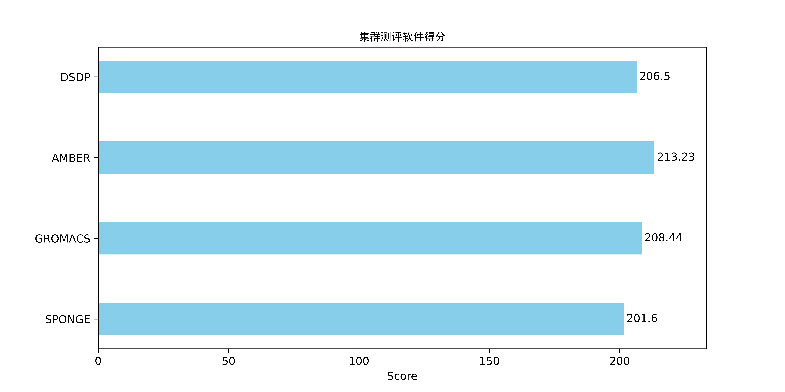

# 集群测评报告
针对生命科学计算的高性能集群性能分析及评测框架，使用代表性生物学计算软件集合，通过Prometheus监控软件对运行时CPU、GPU、内存、IO等资源需求特征进行监控，使用计算用时、计算效率、CPU核时、GPU卡时等关键评价指标对集群性能进行测评和打分，帮助指导生命科学计算集群的建设、提升生命科学计算生产效率。  
在运行集群测评之前，建议先进行单节点深度测评，了解软件运行特征和最高效的运行模式，使用每款软件最高效的运行模式进行集群测评。集群测评模式对每款计算软件在集群大规模并行计算时的运行特征、计算效率进行分析，分析结果用于帮助用户评估相关计算软件在测试集群上运行是否存在瓶颈以及在测试集群配置下的计算效率。  

&nbsp;

## SPONGE
软件版本：v1.4  
数据集：https://doi.org/10.5281/zenodo.12200627 夏 义杰. Test Data for Comparing Simulation Speed between SPONGE and AMBER. Zenodo; 2024.  
测试集群硬件配置：测试集群节点数量2，GPU型号NVIDIA A100-SXM4-80GB，单节点GPU卡数8，单卡显存80.0GB，CPU型号Intel(R) Xeon(R) Platinum 8358 CPU @ 2.60GHz，单节点CPU核心数64，单节点内存容量1007.52GB。文件系统挂载点/rdxfs，文件系统类型lustre，文件系统可用容量800971.11GB，文件系统使用率48%。  
&nbsp;
测评内容：  
1. 大批量任务并行计算集群资源使用情况分析。记录集群在大批量任务并行模式下的GPU、CPU、内存、I/O读写带宽等资源的使用情况和功耗，输出从任务运行到结束的资源使用情况雷达图，帮助用户了解软件在大批量任务并行模式下的集群资源需求特征、分析被测集群配置是否存在瓶颈。
2. 集群大批量任务并行计算打分。  
$$
\begin{align*}
计算用时得分&=系数×\frac{任务数量}{计算用时}\\
计算能耗得分&=系数×\frac{任务数量}{集群总能耗}\\
综合得分&=avg(计算用时得分+计算能耗得分)  
\end{align*}
$$
系数以目前测试的主流配置为基准（100分）来确定，得分是一个相对值且没有上限。  

&nbsp;

### 大批量任务并行计算集群资源使用情况分析：
  
注：从顶端顺时针一周为软件100个任务并行运行期间集群各指标使用情况，将各个指标缩放到同一尺度并使用不同比例尺进行对比展示。(包括CPU使用率、 内存使用量、I/O读带宽、I/O写带宽、功耗)  

  
注：从顶端顺时针一周为软件100个任务并行运行期间集群各指标使用情况，将各个指标缩放到同一尺度并使用不同比例尺进行对比展示。(包括GPU使用率和全部显存使用量)  

  
注：从顶端顺时针一周为软件100个任务并行运行期间集群各指标使用情况，从内向外不同层级分别展示一个指标的变化情况，每个层级内侧线为0，外侧线为该指标全程的最大值，指标范围见图例。  

&nbsp;
GPU使用率峰值：100.0%，中位数100.0%，平均值83.03%  
显存使用峰值：66.92GB，中位数66.92GB，平均值57.86GB  
CPU使用率峰值：100.0%，中位数13.44%，平均值12.11%  
内存使用峰值：39.43GB，中位数37.34GB，平均值35.22GB  
I/O读峰值速率：1.23GB/s，中位数5.35KB/s，平均值5.74MB/s  
I/O写峰值速率：403.95MB/s，中位数42.46KB/s，平均值15.06MB/s  
功耗峰值：7913.0W，中位数7619.0W，平均值7028.31W  
&nbsp;
计算用时得分：100.0
计算能耗得分：100.0
#### 集群大规模并行计算综合得分：100.0
&nbsp;

## GROMACS
软件版本：2023.3  
数据集：1WDN谷氨酰胺结合蛋白在水环境中的模型（61K原子），进行50,000 步（共 100 ps）的 NPT 模拟（恒压恒温），模拟温度为 300 K，压力为 1 atm  
测试集群硬件配置：测试集群节点数量2，GPU型号NVIDIA A100-SXM4-80GB，单节点GPU卡数8，单卡显存80.0GB，CPU型号Intel(R) Xeon(R) Platinum 8358 CPU @ 2.60GHz，单节点CPU核心数64，单节点内存容量1007.52GB。文件系统挂载点/rdxfs，文件系统类型lustre，文件系统可用容量800968.79GB，文件系统使用率48%。  
&nbsp;
测评内容：  
1. 单任务多机多卡并行运行特征分析。记录软件多机多卡并行计算时对GPU、CPU、内存、I/O读写带宽等资源的使用情况和功耗，输出从任务运行到结束的资源使用情况雷达图，帮助用户了解软件资源需求特征、分析被测集群配置是否存在瓶颈。  
2. 单任务多机多卡并行效率分析。使用不同节点数量运行计算软件单任务多机多卡测试，统计计算用时、GPU卡时和分子动力学模拟性能。通过本指标的评测，可以得知计算用时最少的单任务并行策略以及计算卡时最少的单任务并行策略。  
3. 大批量任务并行计算集群资源使用情况分析。记录集群在大批量任务并行模式下的GPU、CPU、内存、I/O读写带宽等资源的使用情况和功耗，输出从任务运行到结束的资源使用情况雷达图，帮助用户了解软件在大批量任务并行模式下的集群资源需求特征、分析被测集群配置是否存在瓶颈。
4. 集群大批量任务并行计算打分。  
$$
\begin{align*}
计算用时得分&=系数×\frac{任务数量}{计算用时}\\
计算能耗得分&=系数×\frac{任务数量}{集群总能耗}\\
综合得分&=avg(计算用时得分+计算能耗得分)  
\end{align*}
$$
系数以目前测试的主流配置为基准（100分）来确定，得分是一个相对值且没有上限。  

&nbsp;

### 单任务多机多卡运行特征分析：
  
注：从顶端顺时针一周为软件单任务使用2个节点并行运行期间各指标使用情况，将各个指标缩放到同一尺度并使用不同比例尺进行对比展示。(包括CPU使用率、 内存使用量、I/O读带宽、I/O写带宽、功耗)  

  
注：从顶端顺时针一周为软件单任务使用2个节点并行运行期间各指标使用情况，将各个指标缩放到同一尺度并使用不同比例尺进行对比展示。(包括GPU使用率和全部显存使用量)  

  
注：从顶端顺时针一周为软件单任务使用2个节点并行运行期间各指标使用情况，从内向外不同层级分别展示一个指标的变化情况，每个层级内侧线为0，外侧线为该指标全程的最大值，指标范围见图例。  

&nbsp;
GPU使用率峰值：27.12%，中位数0.0%，平均值0.15%  
显存使用峰值：17.12GB，中位数17.11GB，平均值17.11GB  
CPU使用率峰值：100.0%，中位数50.4%，平均值50.57%  
内存使用峰值：23.9GB，中位数23.7GB，平均值23.34GB  
I/O读峰值速率：3.75MB/s，中位数4.58KB/s，平均值8.32KB/s  
I/O写峰值速率：1.69MB/s，中位数41.94KB/s，平均值47.84KB/s  
功耗峰值：4634.0W，中位数4260.5W，平均值4273.32W  
&nbsp;

### 单任务多机多卡并行效率分析：
计算用时：  
  
注：横坐标为不同的节点数量（括号内为对应的所用的GPU卡数），纵坐标为任务运行时间，用于对比发现GROMACS多机多卡并行时计算用时最少的运行模式。  
**使用1个节点8张GPU卡并行计算时计算用时最少。**  
&nbsp;
计算所用GPU卡时：  
  
注：横坐标为不同的节点数量（括号内为对应的所用的GPU卡数），纵坐标为计算所用的GPU卡时（GPU卡时=计算所用GPU数量×计算用时），用于对比发现GROMACS多机多卡并行时计算所用GPU卡时最少（GPU最经济）的运行模式。  
**使用1个节点8张GPU卡并行计算时GPU卡时最少。**  
&nbsp;
分子动力学模拟性能：  
  
注：横坐标为不同的节点数量（括号内为对应的所用的GPU卡数），纵坐标为分子动力学模拟性能，用于对比发现GROMACS多机多卡并行时分子动力学模拟性能最高的运行模式。分子动力学模拟性能为分子动力学模拟软件常用的性能指标，单位为ns/day，表示在当前硬件和输入参数条件下每天能够模拟的纳秒数，该值越大代表单位时间内能完成更长时间的分子动力学模拟，代表硬件配置性能更好。  
**使用1个节点8张GPU卡并行计算时分子动力学模拟性能最高。**  
&nbsp;

### 大批量任务并行计算集群资源使用情况分析：
  
注：从顶端顺时针一周为软件100个任务并行运行期间集群各指标使用情况，将各个指标缩放到同一尺度并使用不同比例尺进行对比展示。(包括CPU使用率、 内存使用量、I/O读带宽、I/O写带宽、功耗)  

  
注：从顶端顺时针一周为软件100个任务并行运行期间集群各指标使用情况，将各个指标缩放到同一尺度并使用不同比例尺进行对比展示。(包括GPU使用率和全部显存使用量)  

  
注：从顶端顺时针一周为软件100个任务并行运行期间集群各指标使用情况，从内向外不同层级分别展示一个指标的变化情况，每个层级内侧线为0，外侧线为该指标全程的最大值，指标范围见图例。  

&nbsp;
GPU使用率峰值：50.88%，中位数24.94%，平均值23.36%  
显存使用峰值：20.55GB，中位数17.1GB，平均值17.48GB  
CPU使用率峰值：100.0%，中位数45.82%，平均值47.06%  
内存使用峰值：22.62GB，中位数20.46GB，平均值20.59GB  
I/O读峰值速率：49.34MB/s，中位数9.44KB/s，平均值214.52KB/s  
I/O写峰值速率：2.52MB/s，中位数50.84KB/s，平均值182.77KB/s  
功耗峰值：5813.0W，中位数4680.0W，平均值4688.25W  
&nbsp;
计算用时得分：100.0
计算能耗得分：100.0
#### 集群大规模并行计算综合得分：100.0
&nbsp;

## AMBER
软件版本：24.0  
数据集：1WDN谷氨酰胺结合蛋白在水环境中的模型（61K原子），进行50,000 步（共 100 ps）的 NPT 模拟（恒压恒温），模拟温度为 300 K，压力为 1 atm  
测试集群硬件配置：测试集群节点数量2，GPU型号NVIDIA A100-SXM4-80GB，单节点GPU卡数8，单卡显存80.0GB，CPU型号Intel(R) Xeon(R) Platinum 8358 CPU @ 2.60GHz，单节点CPU核心数64，单节点内存容量1007.52GB。文件系统挂载点/rdxfs，文件系统类型lustre，文件系统可用容量800965.69GB，文件系统使用率48%。  
&nbsp;
测评内容：  
1. 单任务多机多卡并行运行特征分析。记录软件多机多卡并行计算时对GPU、CPU、内存、I/O读写带宽等资源的使用情况和功耗，输出从任务运行到结束的资源使用情况雷达图，帮助用户了解软件资源需求特征、分析被测集群配置是否存在瓶颈。  
2. 单任务多机多卡并行效率分析。使用不同节点数量运行计算软件单任务多机多卡测试，统计计算用时、GPU卡时和分子动力学模拟性能。通过本指标的评测，可以得知计算用时最少的单任务并行策略以及计算卡时最少的单任务并行策略。  
3. 大批量任务并行计算集群资源使用情况分析。记录集群在大批量任务并行模式下的GPU、CPU、内存、I/O读写带宽等资源的使用情况和功耗，输出从任务运行到结束的资源使用情况雷达图，帮助用户了解软件在大批量任务并行模式下的集群资源需求特征、分析被测集群配置是否存在瓶颈。
4. 集群大批量任务并行计算打分。  
$$
\begin{align*}
计算用时得分&=系数×\frac{任务数量}{计算用时}\\
计算能耗得分&=系数×\frac{任务数量}{集群总能耗}\\
综合得分&=avg(计算用时得分+计算能耗得分)  
\end{align*}
$$
系数以目前测试的主流配置为基准（100分）来确定，得分是一个相对值且没有上限。  

&nbsp;

### 单任务多机多卡运行特征分析：
  
注：从顶端顺时针一周为软件单任务使用2个节点并行运行期间各指标使用情况，将各个指标缩放到同一尺度并使用不同比例尺进行对比展示。(包括CPU使用率、 内存使用量、I/O读带宽、I/O写带宽、功耗)  

  
注：从顶端顺时针一周为软件单任务使用2个节点并行运行期间各指标使用情况，将各个指标缩放到同一尺度并使用不同比例尺进行对比展示。(包括GPU使用率和全部显存使用量)  

  
注：从顶端顺时针一周为软件单任务使用2个节点并行运行期间各指标使用情况，从内向外不同层级分别展示一个指标的变化情况，每个层级内侧线为0，外侧线为该指标全程的最大值，指标范围见图例。  

&nbsp;
GPU使用率峰值：23.12%，中位数22.19%，平均值19.41%  
显存使用峰值：29.29GB，中位数29.29GB，平均值27.63GB  
CPU使用率峰值：100.0%，中位数14.36%，平均值14.21%  
内存使用峰值：26.91GB，中位数26.75GB，平均值26.04GB  
I/O读峰值速率：1.08GB/s，中位数1.02GB/s，平均值916.01MB/s  
I/O写峰值速率：1.08GB/s，中位数1.02GB/s，平均值914.78MB/s  
功耗峰值：4257.0W，中位数4229.0W，平均值4192.52W  
&nbsp;

### 单任务多机多卡并行效率分析：
计算用时：  
  
注：横坐标为不同的节点数量（括号内为对应的所用的GPU卡数），纵坐标为任务运行时间，用于对比发现AMBER多机多卡并行时计算用时最少的运行模式。  
**使用1个节点8张GPU卡并行计算时计算用时最少。**  
&nbsp;
计算所用GPU卡时：  
  
注：横坐标为不同的节点数量（括号内为对应的所用的GPU卡数），纵坐标为计算所用的GPU卡时（GPU卡时=计算所用GPU数量×计算用时），用于对比发现AMBER多机多卡并行时计算所用GPU卡时最少（GPU最经济）的运行模式。  
**使用1个节点8张GPU卡并行计算时GPU卡时最少。**  
&nbsp;
分子动力学模拟性能：  
  
注：横坐标为不同的节点数量（括号内为对应的所用的GPU卡数），纵坐标为分子动力学模拟性能，用于对比发现AMBER多机多卡并行时分子动力学模拟性能最高的运行模式。分子动力学模拟性能为分子动力学模拟软件常用的性能指标，单位为ns/day，表示在当前硬件和输入参数条件下每天能够模拟的纳秒数，该值越大代表单位时间内能完成更长时间的分子动力学模拟，代表硬件配置性能更好。  
**使用1个节点8张GPU卡并行计算时分子动力学模拟性能最高。**  
&nbsp;

### 大批量任务并行计算集群资源使用情况分析：
  
注：从顶端顺时针一周为软件100个任务并行运行期间集群各指标使用情况，将各个指标缩放到同一尺度并使用不同比例尺进行对比展示。(包括CPU使用率、 内存使用量、I/O读带宽、I/O写带宽、功耗)  

  
注：从顶端顺时针一周为软件100个任务并行运行期间集群各指标使用情况，将各个指标缩放到同一尺度并使用不同比例尺进行对比展示。(包括GPU使用率和全部显存使用量)  

  
注：从顶端顺时针一周为软件100个任务并行运行期间集群各指标使用情况，从内向外不同层级分别展示一个指标的变化情况，每个层级内侧线为0，外侧线为该指标全程的最大值，指标范围见图例。  

&nbsp;
GPU使用率峰值：61.75%，中位数1.88%，平均值21.71%  
显存使用峰值：69.87GB，中位数45.91GB，平均值45.83GB  
CPU使用率峰值：100.0%，中位数7.97%，平均值8.35%  
内存使用峰值：36.13GB，中位数28.56GB，平均值28.73GB  
I/O读峰值速率：28.58MB/s，中位数6.87KB/s，平均值491.54KB/s  
I/O写峰值速率：7.15MB/s，中位数44.83KB/s，平均值297.68KB/s  
功耗峰值：5917.0W，中位数4165.0W，平均值4567.52W  
&nbsp;
计算用时得分：100.01
计算能耗得分：100.03
#### 集群大规模并行计算综合得分：100.02
&nbsp;

## DSDP
软件版本：v1.0  
数据集：包含995对蛋白质和配体的结构文件的测试数据集  
测试集群硬件配置：测试集群节点数量2，GPU型号NVIDIA A100-SXM4-80GB，单节点GPU卡数8，单卡显存80.0GB，CPU型号Intel(R) Xeon(R) Platinum 8358 CPU @ 2.60GHz，单节点CPU核心数64，单节点内存容量1007.52GB。文件系统挂载点/rdxfs，文件系统类型lustre，文件系统可用容量800962.61GB，文件系统使用率48%。  
&nbsp;
测评内容：  
1. 大批量任务并行计算集群资源使用情况分析。记录集群在大批量任务并行模式下的GPU、CPU、内存、I/O读写带宽等资源的使用情况和功耗，输出从任务运行到结束的资源使用情况雷达图，帮助用户了解软件在大批量任务并行模式下的集群资源需求特征、分析被测集群配置是否存在瓶颈。
2. 集群大批量任务并行计算打分。  
$$
\begin{align*}
计算用时得分&=系数×\frac{任务数量}{计算用时}\\
计算能耗得分&=系数×\frac{任务数量}{集群总能耗}\\
综合得分&=avg(计算用时得分+计算能耗得分)  
\end{align*}
$$
系数以目前测试的主流配置为基准（100分）来确定，得分是一个相对值且没有上限。  

&nbsp;

### 大批量任务并行计算集群资源使用情况分析：
  
注：从顶端顺时针一周为软件100个任务并行运行期间集群各指标使用情况，将各个指标缩放到同一尺度并使用不同比例尺进行对比展示。(包括CPU使用率、 内存使用量、I/O读带宽、I/O写带宽、功耗)  

  
注：从顶端顺时针一周为软件100个任务并行运行期间集群各指标使用情况，将各个指标缩放到同一尺度并使用不同比例尺进行对比展示。(包括GPU使用率和全部显存使用量)  

  
注：从顶端顺时针一周为软件100个任务并行运行期间集群各指标使用情况，从内向外不同层级分别展示一个指标的变化情况，每个层级内侧线为0，外侧线为该指标全程的最大值，指标范围见图例。  

&nbsp;
GPU使用率峰值：85.31%，中位数2.5%，平均值12.36%  
显存使用峰值：49.17GB，中位数20.82GB，平均值26.04GB  
CPU使用率峰值：100.0%，中位数6.43%，平均值7.29%  
内存使用峰值：47.63GB，中位数35.76GB，平均值37.44GB  
I/O读峰值速率：65.38MB/s，中位数1.04MB/s，平均值1.26MB/s  
I/O写峰值速率：708.58MB/s，中位数288.93KB/s，平均值2.87MB/s  
功耗峰值：5130.0W，中位数4056.0W，平均值4193.88W  
&nbsp;
计算用时得分：100.0
计算能耗得分：100.0
#### 集群大规模并行计算综合得分：100.0
&nbsp;

### 集群测评总得分:400.02  
&nbsp;
#### 测试硬件配置：
测试集群节点数量2，GPU型号NVIDIA A100-SXM4-80GB，单节点GPU卡数8，单卡显存80.0GB，CPU型号Intel(R) Xeon(R) Platinum 8358 CPU @ 2.60GHz，单节点CPU核心数64，单节点内存容量1007.52GB。文件系统挂载点/rdxfs，文件系统类型lustre，文件系统可用容量800959.36GB，文件系统使用率48%。  
&nbsp;
#### SPONGE
软件版本：v1.4  
数据集：https://doi.org/10.5281/zenodo.12200627 夏 义杰. Test Data for Comparing Simulation Speed between SPONGE and AMBER. Zenodo; 2024.  
&nbsp;
#### GROMACS
软件版本：2023.3  
数据集：1WDN谷氨酰胺结合蛋白在水环境中的模型（61K原子），进行50,000 步（共 100 ps）的 NPT 模拟（恒压恒温），模拟温度为 300 K，压力为 1 atm  
&nbsp;
#### AMBER
软件版本：24.0  
数据集：1WDN谷氨酰胺结合蛋白在水环境中的模型（61K原子），进行50,000 步（共 100 ps）的 NPT 模拟（恒压恒温），模拟温度为 300 K，压力为 1 atm  
&nbsp;
#### DSDP
软件版本：v1.0  
数据集：包含995对蛋白质和配体的结构文件的测试数据集  
&nbsp;
